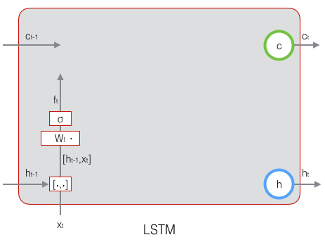
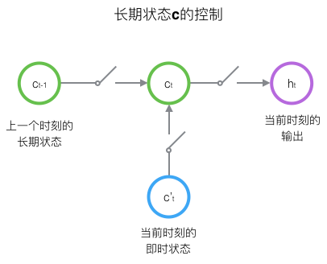
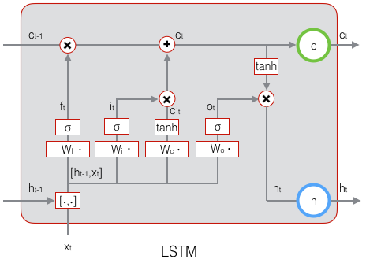
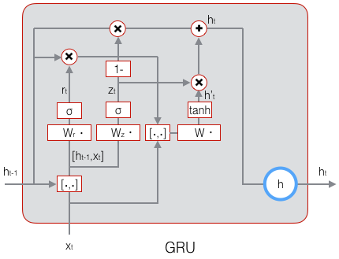

# LSTM

### 上下文长期依赖问题

预测一句话“the clouds are in the sky,”的最后一个词，不需要更长的上文信息，但是对于“I grew up in France… I speak fluent French.” 就需要比较长的上文信息了。
理论上 RNNs 可以捕获较长的上下文信息，但是在实际中这比较困难。

RNNs 中的循环结构

### LSTM 网络结构

LSTMs 的设计被用于来避免长短依赖问题，主要结构如下图所示

穿过流程图上方的平行直线是LSTM的关键，它像一个数据传送带，对数据仅进行简单的线性变化，它很方便的将数据信息进行传送。LSTM 有一个门限机制（遗忘门），它可以控制信息的过滤，是由一个 sigmoid 神经元和一个点乘操作组成。sigmoid 层的输出在0至1之间，描述了可以让多少信息通过，0表示不让任何信息通过，1表示让所有信息通过。

遗忘门

遗忘门的计算

LSTM的思路是使用三个控制开关。第一个开关，负责控制继续保存长期状态c；第二个开关，负责控制把即时状态输入到长期状态c；第三个开关，负责控制是否把长期状态c作为当前的LSTM的输出。三个开关的作用如下图所示：

LSTM用两个门来控制单元状态c的内容，一个是遗忘门（forget gate），它决定了上一时刻的单元状态 $c_{t-1}$ 有多少保留到当前时刻 $$c_t$$；另一个是输入门（input gate），它决定了当前时刻网络的输入 $x_t$ 有多少保存到单元状态 $C_t$ 。LSTM用输出门（output gate）来控制单元状态 $C_t$ 有多少输出到LSTM的当前输出值 $h_t$。

### LSTM 网络的训练

- ft, it, ct, ot,ht五个向量的计算；
- LSTM误差项的反向传播也是包括两个方向：一个是沿时间的反向传播，即从当前t时刻开始，计算每个时刻的误差项；一个是将误差项向上一层传播。

sigmoid和tanh函数的导数都是原函数的函数。这样，我们一旦计算原函数的值，就可以用它来计算出导数的值。

# GRU

GRU对LSTM做了两个大改动：

将输入门、遗忘门、输出门变为两个门：更新门（Update Gate）zt 和重置门（Reset Gate）rt。
将单元状态与输出合并为一个状态：h。

