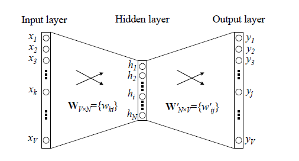

# word2vec

为应对 One hot representation 词向量的高维稀疏问题所带来的内存灾难以及词和词之间的独立性造成的缺陷，word2vec 技术将词投射到一个低维空间，将词的 one hot 编码方式转换为低维稠密的 Dristributed representation。这种向量可以通过余弦相似度等距离计算方式计算词和词之间的关系。

## 一、CBOW与Skip-Gram

CBOW模型的训练输入是某一个特征词的上下文相关的词对应的 one-hot 词向量，而输出就是一个经过softmax处理之后的概率向量，训练目标就是最大化该特定词的概率。比如下面这段话，我们的上下文大小取值为4，特定的这个词是"Learning"，也就是我们需要的输出词向量,上下文对应的词有8个，前后各4个，这8个词是我们模型的输入。

经过前向传播，模型预测的是整个词表 $$V$$ 中每个词的概率，训练目标就是最大化 “learning” 的概率。然后通过反向传播不断更新隐藏层参数，获得所有所有词的隐层表达。

Skip-Gram 模型和 CBOW 的思路是反着来的，即输入是特定的一个词的词向量，而输出是特定词对应的上下文词向量。还是上面的例子，我们的上下文大小取值为4， 特定的这个词 "Learning" 是我们的输入，而这8个上下文词是我们的输出。

DNN 模型的上述两个模型的处理过程非常耗时。我们的词汇表一般在百万级别以上，这意味着我们 DNN 的输出层需要进行 softmax 计算各个词的输出概率的的计算量很大。有没有简化一点点的方法呢？

## 二、霍夫曼树

word2vec 使用霍夫曼树来代替隐藏层和输出层的神经元，霍夫曼树的叶子节点起到输出层神经元的作用，叶子节点的个数即为词汇表的小大。 而内部节点则起到隐藏层神经元的作用。

统计训练语料中所有词的词频，每个词代表一个节点，词频表示该节点的权重，重复选择所有节点中权重最小的两个节点进行合并，直到所有节点都包含在一棵树中，于是建立起了霍夫曼树，如下图所示

在上述霍夫曼树中，可以看到所有叶子节点都代表一个词，词频越高的词离根节点越近。当对所有词进行编码时，我们的高权重节点编码值较短，而低权重值编码值较长。这保证的树的带权路径最短，也符合我们的信息论，即我们希望越常用的词拥有更短的编码。如何编码呢？一般对于一个霍夫曼树的节点（根节点除外），可以约定左子树编码为0，右子树编码为1.如上图，则可以得到 c 的编码是 00。

在 word2vec 中，约定编码方式和上面的例子相反，即约定左子树编码为1，右子树编码为0，同时约定左子树的权重不小于右子树的权重。

## 三、Hierarchical Softmax

如上图所示，传统神经网络训练词向量使用三层的神经网络，输出层使用 softmax ，这样造成的困难在于需要计算所有输出词的概率，然后将所有概率归一化，计算量大。

word2vec 对这个模型做了改进，首先，对于从输入层到隐藏层的映射，没有采取神经网络的线性变换加激活函数的方法，而是采用简单的对所有输入词向量求和并取平均的方法。比如输入的是三个4维词向量：(1,2,3,4),(9,6,11,8),(5,10,7,12),那么我们word2vec映射后的词向量就是(5,6,7,8)。由于这里是从多个词向量变成了一个词向量。

第二个改进就是从隐藏层到输出的softmax层这里的计算量个改进。为了避免要计算所有词的softmax 概率，word2vec 采样了霍夫曼树来代替从隐藏层到输出 softmax 层的映射。我们在上一节已经介绍了霍夫曼树的原理。如何映射呢？这里就是理解 word2vec 的关键所在了。

由于我们把之前所有都要计算的从输出softmax层的概率计算变成了一颗二叉霍夫曼树，那么我们的softmax概率计算只需要沿着树形结构进行就可以了。如下图所示，我们可以沿着霍夫曼树从根节点一直走到我们的叶子节点的词w2。

和之前的神经网络语言模型相比，我们的霍夫曼树的所有内部节点就类似之前神经网络隐藏层的神经元,其中，根节点的词向量对应我们的投影后的词向量，而所有叶子节点就类似于之前神经网络softmax输出层的神经元，叶子节点的个数就是词汇表的大小。在霍夫曼树中，隐藏层到输出层的softmax映射不是一下子完成的，而是沿着霍夫曼树一步步完成的，因此这种softmax取名为"Hierarchical Softmax"。

如何“沿着霍夫曼树一步步完成”呢？在word2vec中，我们采用了二元逻辑回归的方法，即规定沿着左子树走，那么就是负类(霍夫曼树编码1)，沿着右子树走，那么就是正类(霍夫曼树编码0)。判别正类和负类的方法是使用sigmoid函数，即：

$$P(+)=\sigma (x_{w}^T \theta)=\frac{1}{1+e^{-x_{w}^T \theta}}$$

其中$$x_w$$是当前内部节点的词向量，而 θ 则是我们需要从训练样本求出的逻辑回归的模型参数。

使用霍夫曼树有什么好处呢？首先，由于是二叉树，之前计算量为V,现在变成了log2V。第二，由于使用霍夫曼树是高频的词靠近树根，这样高频词需要更少的时间会被找到，这符合我们的贪心优化思想。

容易理解，被划分为左子树而成为负类的概率为P(−)=1−P(+)。在某一个内部节点，要判断是沿左子树还是右子树走的标准就是看P(−),P(+)谁的概率值大。而控制P(−),P(+)谁的概率值大的因素一个是当前节点的词向量，另一个是当前节点的模型参数θ。

使用霍夫曼树来代替传统的神经网络，可以 **提高模型训练的效率**。但是如果我们的**训练样本里的中心词 $$w$$ 是一个很生僻的词，那么就得在霍夫曼树中辛苦的向下走很久了**。能不能不用搞这么复杂的一颗霍夫曼树，将模型变的更加简单呢？

## 四、Negative Sampling

有一个训练样本，中心词是w,它周围上下文共有2c个词，记为 context(w)。由于这个中心词w,的确和 context(w) 相关存在，因此它是一个真实的正例。通过 Negative Sampling 采样，我们得到 neg 个和 w 不同的中心词 wi,i=1,2,..neg，这样context(w)和 $$w_i$$ 就组成了 neg 个并不真实存在的负例。利用这一个正例和 neg 个负例，我们进行二元逻辑回归，得到负采样对应每个词 $$w_i$$ 对应的模型参数 $$\theta_i$$，和每个词的词向量。

从上面的描述可以看出，Negative Sampling 由于没有采用霍夫曼树，每次只是通过采样neg个不同的中心词做负例，就可以训练模型，因此整个过程要比 Hierarchical Softmax 简单。

讲到这里，那么自然需要解决两个问题：1）如何通过一个正例和 neg 个负例进行二元逻辑回归呢？ 2） 如何进行负采样呢？

### 基于Negative Sampling的模型梯度计算

Negative Sampling 也是采用了二元逻辑回归来求解模型参数，通过负采样，我们得到了neg 个负例 (context(w),wi)；i=1,2,..neg。为了统一描述，我们将正例定义为 w0。

在逻辑回归中，我们的正例应该期望满足：

$$P(context(w_0),w_i)=\sigma (x^T_{wi}θ^{wi}),y_i=1,i=0$$

我们的负例期望满足：

$$P(context(w_0),w_i)= 1−\sigma (x^T_iθ^{wi}),y_i=0,i=1,2,..,neg $$

我们期望可以最大化下式：

$$\prod_{i=0}^{neg} P(context(w_0),w_i) = \sigma (x^Tw_0 \theta ^{w0}) \prod _{i=1}^{neg}(1−\sigma (x^Tw_i \theta ^{wi}))$$

我们容易写出此时模型的似然函数为：

$$\prod_{i=0}^{neg} \sigma (x^Tw_i \theta ^{wi})^{yi}(1−\sigma (x^Tw_i \theta ^{wi}))^{1−y_i}$$

此时对应的对数似然函数为：

$$L= \sum _{i=0} ^{neg} yi log(\sigma (x^Tw_i \theta ^{wi}))+(1−y_i) log(1−\sigma (x^Tw_i \theta ^{wi}))$$

和 Hierarchical Softmax 类似，我们采用随机梯度上升法，仅仅每次只用一个样本更新梯度，来进行迭代更新得到我们需要的 $$x_{wi},θ^{wi},i= 0,1,..neg$$ , 这里我们需要求出 $$x_{wi},θ^{wi},i=0,1,..neg$$ 的梯度。

首先我们计算 $$θ^{wi}$$ 的梯度：

$$ \frac{\partial L}{\partial θ^{wi}} = y_i(1− \sigma (x^T_{wi} θ^{wi}))x_{wi} −(1−y_i) \sigma (x^T_{wi} \theta ^{wi})x_{wi}=(y_i− \sigma (x^T_{wi}θ^{wi}))x_{wi}$$

同样的方法，我们可以求出xwi的梯度如下：

$$\frac{\partial L}{\partial x_{wi}} =(y_i− \sigma (x^T_{wi} θ^{wi})) \theta ^{wi}$$

有了梯度表达式，我们就可以用梯度上升法进行迭代来一步步的求解我们需要的 $$x_{wi},θ^{wi},i= 0,1,..neg$$ 。

### Negative Sampling负采样方法

现在我们来看看如何进行负采样，得到 neg 个负例。word2vec 采样的方法并不复杂，如果词汇表的大小为 V,那么我们就将一段长度为 1 的线段分成 V 份，每份对应词汇表中的一个词。当然每个词对应的线段长度是不一样的，高频词对应的线段长，低频词对应的线段短。每个词 w的线段长度由下式决定：

$$len(w)= \frac {count(w)}{\sum _{u \in vocab} count(u)}$$

在word2vec中，分子和分母都取了3/4次幂如下：

$$len(w)= \frac {count(w)^{3/4}}{\sum _{u \in vocab} count(u)^{3/4}}$$

在采样前，我们将这段长度为1的线段划分成M等份，这里M >> V，这样可以保证每个词对应的线段都会划分成对应的小块。而M份中的每一份都会落在某一个词对应的线段上。在采样的时候，我们只需要从 M 个位置中采样出 neg 个位置就行，此时采样到的每一个位置对应到的线段所属的词就是我们的负例词。

在word2vec中，M 取值默认为$$10^8$$。

