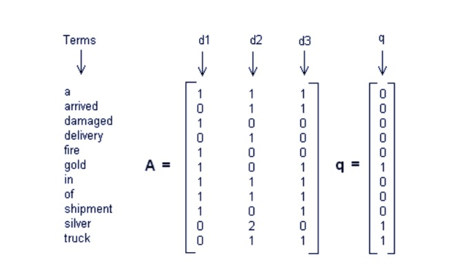
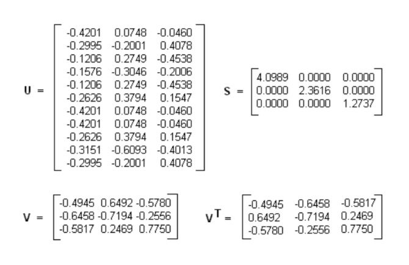
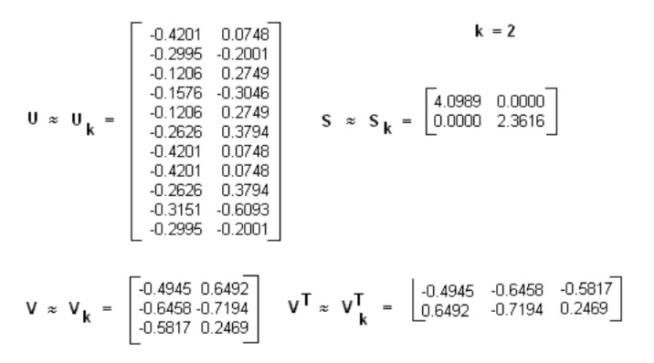
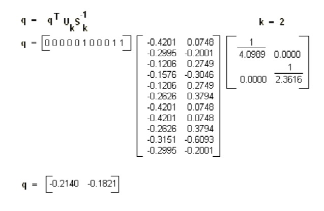
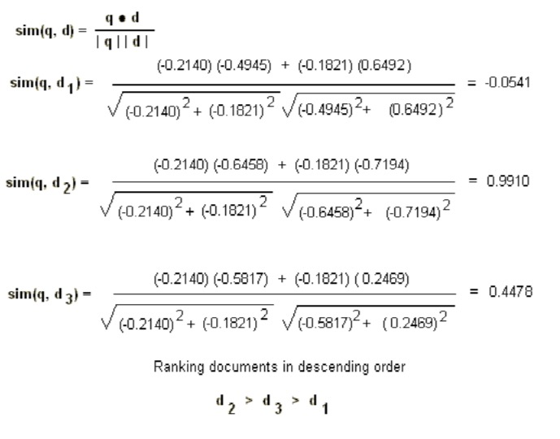

# 主题模型 -- LSI & LDA

聚类算法关注于从样本特征的相似度方面将数据聚类。比如通过数据样本之间的欧式距离，曼哈顿距离的大小聚类等。而主题模型，顾名思义，就是对文字中隐含主题的一种建模方法。比如从“人民的名义”和“达康书记”这两个词我们很容易发现对应的文本有很大的主题相关度，但是如果通过词特征来聚类的话则很难找出，因为聚类方法不能考虑到到隐含的主题这一块。

那么主题聚类是怎样进行呢？假设以一定的概率选择了一个主题，然后以一定的概率选择当前主题的词。最后这些词组成了我们当前的文本。所有词的统计概率分布可以从语料库获得，具体如何以“一定的概率选择”，这就是各种具体的主题模型算法的任务了。

当然还有一些不是基于统计的方法，比如我们下面讲到的LSI。

## LSI

$$A_{m×n} ≈ U_{m×k} Σ _{k×k} V^T_{k×n}$$

如果把上式用到我们的主题模型，则 SVD 可以这样解释：我们输入的有 m 个文本，每个文本有n 个词。而 $$A_{ij}$$ 则对应第 i 个文本的第 j 个词的特征值，这里最常用的是基于预处理后的标准化 TF-IDF 值。k 是我们假设的主题数，一般要比文本数少。SVD 分解后，$$U_{il}$$ 对应第 i 个文本和第 l 个主题的相关度。$$V_{jm}$$ 对应第 j 个词和第 m 个词义的相关度。$$Σ_{lm}$$对应第 l 个主题和第 m 个词义的相关度。

$$U, Σ, V$$ 对应的关系：文本 <---> 主题 <---> 词义 <---> 词

也可以反过来解释：我们输入的有 m 个词，对应 n 个文本。而 $$A_{ij}$$ 则对应第i个词档的第 j 个文本的特征值，这里最常用的是基于预处理后的标准化 TF-IDF 值。k 是我们假设的主题数，一般要比文本数少。SVD分解后，$$U_{il}$$ 对应第 i 个词和第 l 个词义的相关度。$$V_{jm}$$ 对应第 j 个文本和第 m 个主题的相关度。$$Σ_{lm}$$ 对应第 l 个词义和第 m 个主题的相关度。

这样我们通过一次SVD，就可以得到文档和主题的相关度，词和词义的相关度以及词义和主题的相关度。

### LSI 的使用

已有三篇文档：

- d1: Shipment of gold damaged in a fire.
- d2: Delivery of silver arrived in a silver truck. 
- d3: Shipment of gold arrived in a truck.

构建词库和文档矩阵：

进行矩阵分解：$$A = U*S*V^T$$

选取top2大的奇异值

得到三篇文档的向量表达：

- $$d1:[-0.4945,0.6492]$$
- $$d2:[-0.6458,-0.7194]$$
- $$d3:[-0.5817,0.2469]$$

使用公式 $$q = q^T*U_k*S_k^{-1}$$ 计算查询语句的向量表达：

计算查询向量和三篇文档的相似度

### LSI 总结

LSI是最早出现的主题模型了，它的算法原理很简单，一次奇异值分解就可以得到主题模型，同时解决词义的问题，非常漂亮。但是LSI有很多不足，导致它在当前实际的主题模型中已基本不再使用。

主要的问题有：

1. SVD计算非常的耗时，尤其是我们的文本处理，词和文本数都是非常大的，对于这样的高维度矩阵做奇异值分解是非常难的。
2. 主题值的选取对结果的影响非常大，很难选择合适的k值。
3. LSI得到的不是一个概率模型，缺乏统计基础，结果难以直观的解释。

对于问题1，主题模型非负矩阵分解（NMF）可以解决矩阵分解的速度问题。对于问题2，这是老大难了，大部分主题模型的主题的个数选取一般都是凭经验的，较新的层次狄利克雷过程（HDP）可以自动选择主题个数。对于问题3，牛人们整出了pLSI(也叫pLSA)和隐含狄利克雷分布(LDA)这类基于概率分布的主题模型来替代基于矩阵分解的主题模型。

回到LSI本身，对于一些规模较小的问题，如果想快速粗粒度的找出一些主题分布的关系，则LSI是比较好的一个选择，其他时候，如果你需要使用主题模型，推荐使用LDA和HDP。