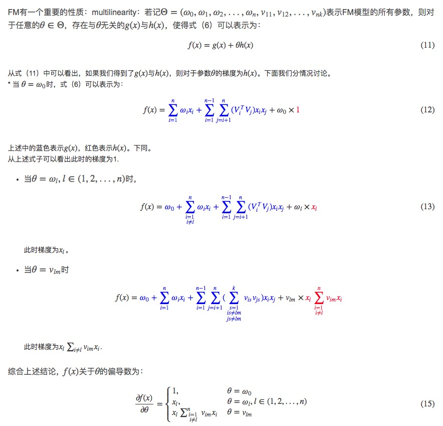

# FM&FFM模型

### 线性模型

早期点击率预估模型中，一般使用线性模型，它简单易解释，但是存在许多问题，比如它只考虑了每个特征对结果的单独影响，忽略了特征之间的组合对结果的影响。线性回归的形式如下：

$$f(x) = \omega_0 + \omega_1x_1+\omega_2x_2+...+\omega_nx_n =\omega_0+\sum_{i=1}^n{\omega_ix_i}$$

### 二项式模型

为了对组合特征进行建模，我们可以建立二项式模型，如下所示：

$$f(x) = \omega_0 + \sum_{i=1}^n \omega_ix_i + \sum_{i=1}^{n-1}\sum_{j=i+1}^n \omega_{i,j}x_ix_j$$

从上式可以看到，对于参数 $$\omega_{i}$$ 的训练，只要这个样本中对应的 $$x_i$$ 不为0，则可以完成一次训练，但是对于参数 $$\omega_{i,j}$$，则需要 $$x_i,x_j$$ 同时不为0，才可以训练一次，但是在数据稀疏的应用场景中，$$x_i,x_j$$ 同时不为0的样本比较稀少，这就导致参数 $$\omega_{i,j}$$ 非常难以训练，这样训练出来的参数也不准确。

## FM模型

为了解决上述数据稀疏引起的训练不足的问题，FM 模型的思想就是为每个特征维度 $$x_i$$ 引入一个辅助向量：

$$V_i=(v_{i1},v_{i2},v_{i3},...,v_{ik})^T ∈ ℝ^k,i=1,2,3,...,n$$

其中k为辅助变量的维度，依经验而定，一般而言，对于特征维度足够多的样本，k<8. 对于因子分解机FM来说，最大的特点是对于稀疏的数据具有很好的学习能力。

### FM参数求解

我们的目标是要求得以下交互矩阵

 $$W =(\omega_{i,j})_{n*n} \ \  i,j = 1,2,...,n$$  
 
 引入隐变量：
 
 $$V = (v_{ij})_{n*k} = [V_1^T,V_2^T,...,V_n^T]^T; \ \ i=1,2,..,n \ ;\ j=1,2,..,k$$
 
 令 $$VV^T = W$$，如果可以先求得 $$V$$ ,则可以得到 $$W$$。理论研究表明：当 k 足够大时，对于任意对称正定的实矩阵 $$W ∈ ℝ^{n×n}$$，均存在实矩阵$$V ∈ ℝ^{n×k}$$，使得$$W=VV^T$$。理论分析中要求参数 k 足够的大，但在高度稀疏数据的场景中，由于 没有足够的样本，因此k通常取较小的值。事实上，对参数 k 的限制，在一定程度上可以提高模型的泛化能力。
 
 **参数个数**：$$1+n+nk$$
 
 ***FM 模型***就是二项式模型加入隐变量之后可以写成如下形式：
 
 $$f(x) = \omega_0 + \sum_{i=1}^n \omega_ix_i + \sum_{i=1}^{n-1}\sum_{j=i+1}^n (V_i^TV_j)x_ix_j$$
 
可以看出时间复杂度是$$O(kn^2)$$。但我们对上述式子的最后一项作变换后，可以得出一个$$O(kn)$$的时间复杂度表达式。

$$
\sum_{i=1}^{n-1}\sum_{j=i+1}^n(V_i^TV_j)x_ix_j 
= \frac{1}{2}\left(\sum_{i=1}^n\sum_{j=1}^n(V_i^TV_j)x_ix_j-\sum_{i=1}^n(V_i^TV_i)x_ix_i\right)\\
=\frac{1}{2}\left(\sum_{i=1}^n\sum_{j=1}^n\sum_{l=1}^kv_{il}v_{jl}x_ix_j-\sum_{i=1}^n\sum_{l=1}^k v_{il}^2x_i^2\right)\\\
=\frac{1}{2}\sum_{l=1}^k\left(\sum_{i=1}^n(v_{il}x_i)\sum_{j=1}^n(v_{jl}x_j)-\sum_{i=1}^nv_{il}^2x_i^2\right)\\
=\frac{1}{2}\sum_{l=1}^k\left(\left(\sum_{i=1}^n(v_{il}x_i)\right)^2-\sum_{i=1}^nv_{il}^2x_i^2\right)\\
$$ 

上述式子中的 $$\sum^n_{i=1}(v_{il}x_i)$$ 只需要计算一次就好，因此，可以看出上述模型的复杂度为 $$O(kn)$$。

### 训练时间复杂度

由上述式（15）可以得到：

$$x_l \sum_{i=1,i≠l}^n v_{im}x_i = xl \sum_{i=1}^nv_{im}x_i−v_{lm}x^2_l$$

对于上式中的前半部分 $$\sum ^n_{i=1}v_{im}x_i$$，对于每个样本只需要计算一次，所以时间复杂度为O(n)，对于k个隐变量的维度分别计算一次，则复杂度为O(kn)。其它项的时间复杂度都小于这一项，因此，模型训练的时间复杂度为O(kn)。

## FFM 模型

在FM模型中，每一个特征会对应一个隐变量，但在FFM模型中，认为应该将特征分为多个field，每个特征对应每个field分别有一个隐变量。

举个例子，我们的样本有3种类型的字段：publisher, advertiser, gender，分别可以代表媒体，广告主或者是具体的商品，性别。其中publisher有5种数据，advertiser有10种数据，gender有男女2种，经过one-hot编码以后，每个样本有17个特征，其中只有3个特征非空。

如果使用FM模型，则17个特征，每个特征对应一个隐变量。
如果使用FFM模型，则17个特征，每个特征对应3个隐变量，即每个类型对应一个隐变量，具体而言，就是对应publisher, advertiser, gender三个 field 各有一个隐变量。

**FFM 模型**定义如下：

$$f(x)= \omega_0 + \sum_{i=1}^n \omega_ix_i+ \sum_{j1=1}^{n−1} \sum _{j2=i+1}^n(V^T_{j1,f2}V_{j2,f1})x_{j1}x_{j2}$$

其中 $$j_1,j_2$$ 表示特征的索引。我们假设 $$j_1$$ 特征属于 $$f_1$$ 这个 field，$$j_2$$ 特征属于 $$f_2$$ 这个 field，则 $$V_{j1},f_2$$ 表示 $$j_1$$ 这个特征对应 $$f_2$$ ($$j_2$$ 所属的field)的隐变量，同时 $$V_{j2},f_1$$表示 $$j_2$$ 这个特征对应 $$f_1$$ ($$j_1$$ 所属的field)的隐变量。

事实上，在大多数情况下，**FFM模型只保留了二次项**，即：

$$\phi (V,x)=\sum_{j1=1}^{n−1} \sum _{j2=i+1}^n(V^T_{j1,f2}V_{j2,f1})x_{j1}x_{j2}$$

### 损失函数

$$min \frac{λ}{2}||V||^2_2+ \sum_{i=1}^m log(1+exp(−y_i \phi(V,x)))$$

上面加号的前面部分使用了 $$L2$$ 范式，后面部分是逻辑回归的损失函数。m表示样本的数量，yi表示训练样本的真实值（如是否点击的-1/1），$$ϕ(V,x)$$ 表示使用当前的 $$V$$ 代入式（18）计算得到的值。

注意，以上的损失函数适用于样本分布为 $$\{-1,1\}$$的情况。

### 关于初始参数的设定

文献1中如此建议： 

1. $$\eta$$：没有具体的建议，用户根据经验指定即可，一般会取0.1，0.01，0.001。 
2. $$V$$：在区间$$[0,1/\sqrt k]$$ 间的随机值，均匀分布即可。 
3. $$G$$：设置为1，以避免 $$(G_{j1,f2})^{−\frac{1}{2}}_d$$ 出现很大的值,$$G$$为累积梯度平方。

**时间复杂度**: $$O(kn^2)+1+2k+2k+2k=O(kn^2)$$

## 模型优化

### 特征编码连续

如果特征的编码不连续，比如编码是有意义的，或者预留空间给之后的编码。如果直接使用最大编码值的作为参数数据尺寸，则会导致大量内存空间的浪费，因此有2种解决方案： 

（1）使用hashmap，而非数组。 

（2）将有意义的编码映射到一个连续的编码空间。 

目前我们使用方式（1），理论上方式（2）的计算速度会更快。

### 一次项缺失的影响

正如上面式（18）所言，我们经常会忽略了一次项的影响，因此我们可以为每个样本加上一个辅助特征，这相特征的值恒为1，这相当于引入了一次项。

另一种更常规的方法是直接作为一次项的逻辑回归来作训练。

### 样本归一化

文献1还建议，将样本向量的长度归一化后，性能有少量的提升。 
$$R[i]=\frac{1}{||X||} $$

FFM默认是进行样本数据的归一化，即 为真；若此参数设置为假，很容易造成数据inf溢出，进而引起梯度计算的nan错误。因此，样本层面的数据是推荐进行归一化的。

### 特征归一化

某些特征（如购买个数）有可能很大，而一些类别参数则恒为1，这将导致不同特征最终对模型的影响相关很大，这很不合理。

CTR/CVR模型采用了多种类型的源特征，包括数值型和 categorical 类型等。但是，categorical 类编码后的特征取值只有 0 或 1，较大的数值型特征会造成样本归一化后categorical 类生成特征的值非常小，没有区分性。例如，一条用户-商品记录，用户为 “男” 性，商品的销量是 5000 个（假设其它特征的值为零），那么归一化后征 “sex=male”（性别为男）的值略小于 0.0002，而 “volume”（销量）的值近似为 1。特征 “sex=male” 在这个样本中的作用几乎可以忽略不计，这是相当不合理的。因此，将源数值型特征的值归一化到 是非常必要的。

### 省略零值特征

从FFM模型的表达式可以看出，零值特征对模型完全没有贡献。包含零值特征的一次项和组合项均为零，对于训练模型参数或者目标值预估是没有作用的。因此，可以省去零值特征，提高FFM模型训练和预测的速度，这也是稀疏样本采用FFM的显著优势。