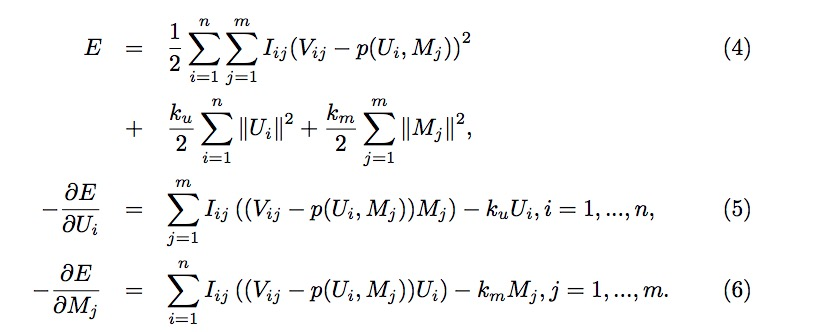
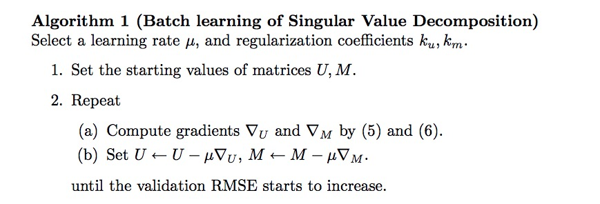
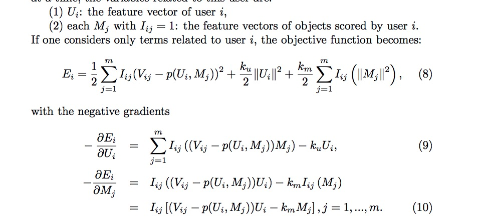
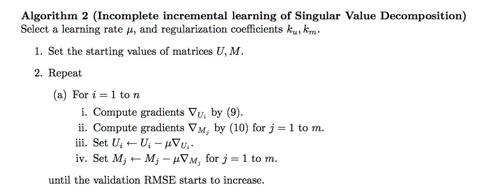
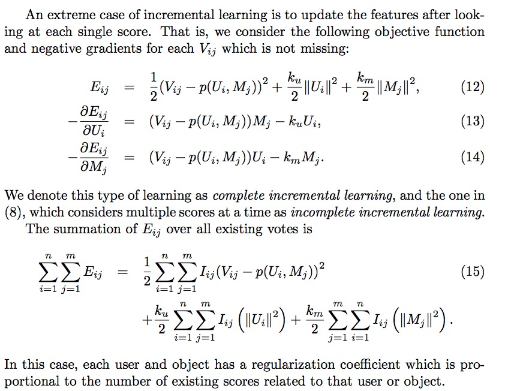
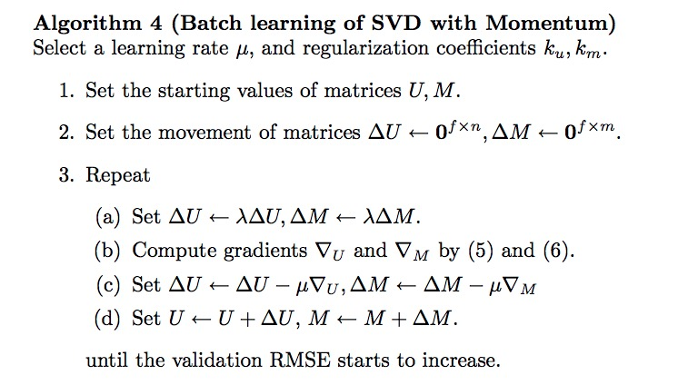

#推荐系统--SVD应用于协同过滤
SVD 应用于协同过滤

协同过滤是一种从大量用户给出的兴趣爱好集合中预测用户的偏好和兴趣的技术。 它的**基本假设**是，对某个事物，人们过去喜欢那么将来也会喜欢。 协作过滤可以用于推荐系统，该推荐系统自动向用户建议他/她的首选产品。

###问题定义
如果有 n 个用户和 m 个物品，已知有一些用户对某些物品进行过 1-5 分的评分，但是很多用户也不可能对大多数物品都有评分记录，因此我们可以构建出一个非常大的稀疏矩阵。假设这个矩阵为 $$V \in R^{n*m}$$ ，令 $$I_{ij}$$ 为用户 i 对物品 j 的评分，可以知道 $$I_{ij}$$ 的取值为 $$I \in \{0,1\}$$，这里假设有评分记录就为 1，否则为 0 。

我们使用矩阵 $$V$$ 作为协同过滤算法的训练数据，目的就是预测出那些 $$V_{i,j}=0$$ 的位置的值（也就是没有评分的缺失值）。令 $$A \in R^{n*m}$$ 作为包含所有或部分的确实投票数据的稀疏矩阵，作为真实值结果（ground-truth answer），令$$P \in R^{n*m}$$ 作为预测矩阵，令 $$J \in \{0,1\}^{n*m}$$ 作为矩阵 A 中元素值的指示函数；我们可以用 RMSE 指标来做训练损失函数：

$$RMSE(P,A)=\sqrt{\frac{\sum_{i=1}^n \sum_{j=1}^m J_{ij}(A_{ij}-P_{ij})^2}{\sum_{i=1}^n \sum_{j=1}^m J_{ij}}}$$

从上式可以看出，分母部分消除了评分矩阵 A 中评分数量多寡的影响。有了训练数据，那么测试数据怎么选取呢？根据 *Netflix Prize* 的做法，他们选取固定数量的用户在训练集数据以外的时间段对物品的最新评分作为测试集。在进行模型训练时，我们知道，历史数据越多越有利于参数的训练，因此对于那些在过去只进行少量评分次数的用户，或者新用户来说，预测他们的兴趣将是协同过滤的一大挑战。

##SVD
已知我们有矩阵 $$V$$，SVD 的目的在于寻找两个矩阵 $$U \in R^{f*n}$$ 和 $$M \in R^{f*m}$$ 分别代表用户特征矩阵和物品特征矩阵。预测函数 p 被用于预测 V 中的缺失值的值。假设 $$U_i$$ 表示用户 i 的特征向量，$$M_j$$ 表示物品 j 的特征向量，那么我们有

$$V_{ij} = p(U_i,M_j)$$

计算矩阵 U 和 M 可以使用 RMSE 来优化，使用以下公式来表示：

$$E = \frac{1}{2}\sum_{i=1}^n \sum_{j=1}^m J_{ij}I_{ij}(V_{ij}-p(U_i,M_j))^2 + \frac{k_u}{2}\sum_{i=1}^n ||U_i||^2 +  \frac{k_m}{2}\sum_{j=1}^m ||M_j||^2$$

$$k_u, k_m$$ 分别是用户和物品项的正则系数，可以看出上式的两部分正则项所起到的作何和上文讲的 RMSE 公式的作用是一致的，都是用来抑制评分矩阵中评分数量的多寡所带来的影响。

预测函数 p 一般使用特征向量的点积，因此有：

$$ p(U_i,M_j) = U_i^TM_j$$

然而在实际应用中，用户的实际评分 $$V_{ij} $$ 是有一个范围的 [a,b]，比如电影评分只在区间 [1,5]，因此对于预测函数 P 有以下形式来对预测值做修正：

$$
（公式3-1）\ p(U_i,M_j)=\begin{cases}
a,\quad \quad \quad \quad if\ U_i^TM_j<0\\
a + U_i^TM_j, \quad if\ 0<=U_i^TM_j<=b-a\\
b, \quad \quad \quad \quad if \ U_i^TM_j>b-a
\end{cases}
$$

在这篇论文中只考虑了用户是否对物品进行了评分，而没有考虑评多少分；对于有评分数值的应用，预测函数在其他文献有另一种写法，加入使用向量 $$b_i$$ 表示电影 i 的评分相对于平均评分的偏差，向量 $$b_u$$ 表示用户 u 做出的评分相对于平均评分的偏差，将平均评分记做 $$\mu$$，则评分函数可以写成：

$$p(U_i,M_j) = \mu + b_i + b_u + U_i^TM_j \  (公式3-2)$$

加上偏差 b ,我的理解是，不同用户的心里评分标准是不同的。比如张三，他对所有影片的评分都在 1-3分之间，而李四对于所有电影的评分都在 3-5之间，也就是他们对电影的评分习惯和对电影的严苛挑刺程度是不同的，所以我们训练模型时应当去学习这种用户特性，在对未知测试数据进行预测时也要考虑这样的差异。

目标函数和负梯度形式：

###训练算法(SVD 批量训练)

在进行梯度下降训练时，我们需要对矩阵 U ,M 进行初始化，然后根据计算出的梯度来逐步更新矩阵中的元素（参数）；那么怎么初始化呢？一种方式是随机初始化，但是这样会导致训练结果的不稳定，随机性太大。我们可以使用已有分数的平均值来初始化两个矩阵，如下：

$$U_{ij},M_{ij} = \sqrt{\frac{\overline V -a}{f}} + n(r) \ \ for\ each\  i,j$$

其中 a 是评分区间的下限，f 是 SVD 的维度，n(r) 是随机噪声，它服从均匀分布 [-r,r]，r 设置一个较小的数就可以。如果没有随机噪声的话，那么在优化时，用户和物品的特征将会一直具有相同的梯度。

批量学习是 SVD 的标准方法，但是对于大规模的稀疏矩阵，计算的梯度将会具有很大的方差，需要较小的学习率来预防 divergence.

##SVD 变体
###不完全增量学习
批量学习方法对于大规模数据训练缓慢，如果每次增加新的训练数据就去训练一次，可能就太花时间了，那么能不能不用从头开始的训练方式呢？我们可以使用增量学习来解决这个问题，即，在后期迭代模型时，我们只训练之前没参与训练的数据就行了。

例如，对于用户 i ,如果我们又有了他的新的评分数据，与该用户相关的变量如下：

可以看到，当 $$I_{ij}=0$$ 时，梯度 $$M_J$$ 等于 0 ，因此，那些用户 i 没有进行评分的物品向量的参数没有进行更新，也就是不需要重新学习，我们仅需要重新学习用户有过打分行为的物品的参数。

###完全增量学习

###带动量的批量学习
使用增量学习方式可以节省一些训练时间，另外我们也可以使用带动量的学习方式来加大学习率以加快训练速度。

