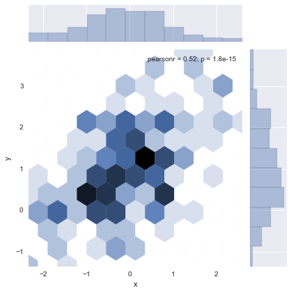
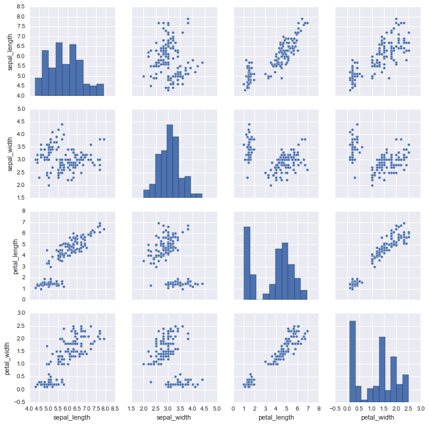
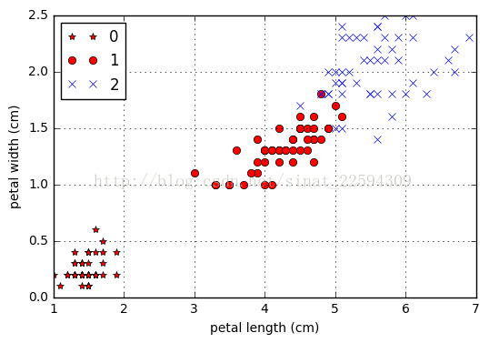
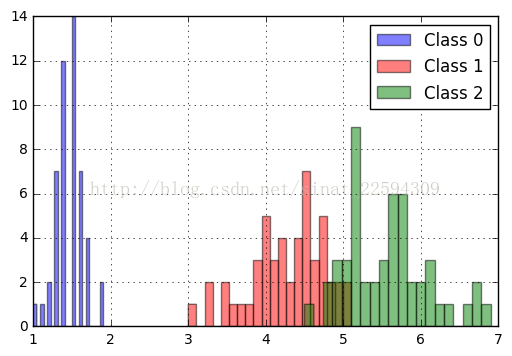
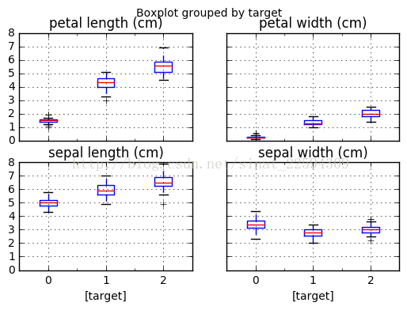
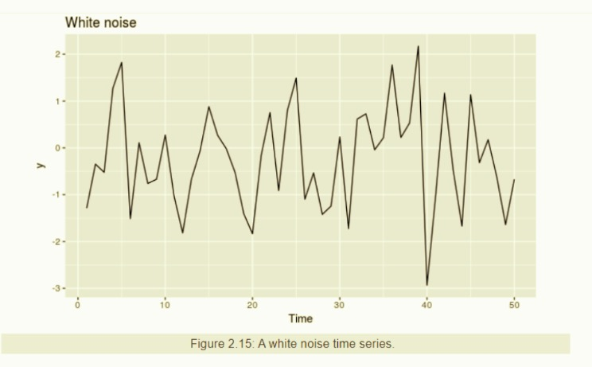

# 数据挖掘竞赛操作指南 -- 结构化数据篇

结构化的数据是指可以使用关系型数据库表示和存储，表现为二维形式的数据。一般特点是：数据以行为单位，一行数据表示一个实体的信息，每一行数据的属性是相同的。举一个例子：

```
id      name    age     gender
1       lyh     12      male
2       liangyh 13      female
3       liang   18      male
```
各个平台举办的数据挖掘类竞赛中，大部分都是结构化数据，特别是早期；近年来随着自然语言处理和计算机视觉的兴起，非结构化数据类型的数据挖掘竞赛也越来越多。针对结构化数据挖掘竞赛，这里总结一下基本的竞赛操作指南。

## 1、数据探索分析

拿到数据，我们首先需要做的是对数据进行探索分析，从整体了解数据，把握数据。

### 分布分析

1. 定量数据：频率分析、频率分布表、直方图、茎叶图
2. 定性数据：饼图、条形图

### ①特征变量分析

分析*变量之间两两的分布和相关度*，可以用于发现高相关和共线性的特征。我们可以看看数据中各个特征的协方差矩阵和相似度矩阵：

```python
data_df.cov()
data_df.corr()
```

协方差的值接近于 0 表明两个变量不具有（线性）关系。对于**数据探索，相关性比协方差更可取**。相关矩阵 R 的第 ij 个元素是数据的第 i 个和第 j 个属性之间的相关性。

$$r_{ij} = correlation(x_i,x_j)= covariance(x_i,x_j)/s_is_j$$

其中 $$s_i$$ 和 $$s_j$$ 分别是 $$x_i,x_j$$ 的方差。

线性相关性指标：

- $$|r|<=0.3$$ 为不存在线性相关
- $$0.3<|r|<=0.5$$ 为低度线性相关
- $$0.5<|r|<=0.8$$ 为显著线性相关
- $$|r|> 0.8$$ 为高度线性相关

### ②目标变量的分布

- 目标变量为连续值（回归）：查看其值域范围是否较大，如果较大，可以考虑对其进行对数变换，并以变换后的值作为新的目标变量进行建模（在这种情况下，需要对预测结果进行逆变换）。一般情况下，可以对连续变量进行Box-Cox变换。通过变换可以使得模型更好的优化，通常也会带来效果上的提升。
- 目标变量为离散值（分类）：如果数据分布不平衡，考虑是否需要上采样/下采样；如果目标变量在某个ID上面分布不平衡，在划分本地训练集和验证集的时候，需要考虑分层采样（Stratified Sampling）

### 统计量分析

用统计学指标对定量数据进行描述性分析，例如均值，中位数，众数；极差，标准差，四分位数间距等。

散布度量：极差和方差，这种度量表明属性值是否散布很宽，或者是否相对集中在单个点（如均值）附近。

给定一个属性x，它具有 m 个值 $${x1,x2,...,xm}$$，x 的极差定义为：$$range(x)=max(x)-min(x)$$。尽管极差标识最大散布，但是如果大部分值都集中在一个较小的范围内，并且更极端的值的个数相对较少，则可能会引起误解。因此，**作为散布的度量，方差和标准差更可取**。

使用 DataFrame 进行统计分析，如果是分类任务，我们可以看看每个类别下各个特征的分布有没有区别。

```python
data_df[data_df['target']==0].describe()
data_df[data_df['target']==1].describe()
data_df[data_df['target']==2].describe()
```

### 缺失值分析

缺失值产生的原因：

1. 有些信息暂时无法获取，或者获取信息的代价太大。
2. 有些信息是被遗漏的。可能是因为输入时认为不重要、忘记填写或对数据理解错误等一些人为因素而遗漏，也可能是由于数据采集设备的故障、存储介质的故障、传输媒体的故障等非人为原因而丢失。
3. 属性值不存在。在某些情况下，缺失值并不意味着数据有错误。对一些对象来说某些属性值是不存在的，如一个未婚者的配偶姓名、一个儿童的固定收入等。

### 异常值分析

异常可能由于测量、输入错误或系统运行错误而造成，也可能是由数据内在特性引起的，或异常行为所导致。异常值分析是检验数据是否含有不合理的数据。由于异常产生的机制是不确定的，因此，异常检测算法检测出的“异常”是否真正地对应为实际的异常行为，不是由异常检测算法来说明、解释的，只能由领域专家来解释。

**异常值分析常用方法：**

1. 描述性统计分析
2. Z得分
3. 箱形图分析

### 可视化

为了总体的，更直观的观察数据的分布，我们可以使用可视化技术来分析数据。常用的工具有：<font color=red>`matplotlib，seaborn`</font> 。

一些基本绘图操作：

1. <font color=red>单变量</font>

直方图：`plt.hist(x, bins=10)`。

Kdeplot：`sns.kdeplot(x,shade=True)`。

Distplot：`sns.distplot(x, bins=20, kde=False, rug=True)`，通过观察bin来对数据进行切分并做one-hot编码形成新的特征。

2. <font color=red>双变量</font>

Scatterplot：`plt.scatter(df['x'].values,df['y'].values)`，当数据比较多的时候,建议采样观察,不然真的很耗时.通过Scatterplot我们可以很容易的发现一些数据的分布规律,是否有簇的存在等等,在涉及类似于经纬度的问题时,我们经常会通过scatterplot看数据,然后考虑聚类等操作.

Jointplot：`sns.jointplot(x="x", y="y", data=df)`；Hexbin绘图和KDE绘图,这两个绘图大致可以更加<font color=red>直观的炫酷的</font>看出数据的一个分布情况(例如hex图,越白的地方数据就越少,基本都没有数据在那里)。`sns.jointplot(x="x", y="y", data=df,kind ='hex' )`



pairplot: 该函数会同时绘制数据中所有特征两两之间的关系图.因为pairplot是建立在pairgrid之上,所以可以将中间的很多函数进行变换,例如下面的kde的例子.

```
iris = sns.load_dataset("iris")
sns.pairplot(iris);
```



</font size=6>对于分类数据</font>而言，由于我们可以用颜色或者标记去区别不同的类，所以我们的坐标轴可以全部用于属性的表示，比如说在这里我们可以用一个二维图来表示每个样本对应的两个属性的分布

```python
from matplotlib import pyplot as plt
plt.plot(data_df[data_df['target']==0]['petal length (cm)'],data_df[data_df['target']==0]['petal width (cm)'],'r*',label='0')
plt.plot(data_df[data_df['target']==1]['petal length (cm)'],data_df[data_df['target']==1]['petal width (cm)'],'ro',label='1')
plt.plot(data_df[data_df['target']==2]['petal length (cm)'],data_df[data_df['target']==2]['petal width (cm)'],'bx',label='2')
plt.xlabel('petal length (cm)')
plt.ylabel('petal width (cm)')
plt.legend(loc='best')
plt.grid()
plt.show()
```



使用直方图可以观察并比较每个类别的各项属性的分布，通过箱形图我们则可以比较不同类别的各项属性的分布及集中程度。

```python
from matplotlib import pyplot as plt
plt.hist(data_df[data_df['target']==0]['petal length (cm)'],color='blue',label='Class 0',alpha=0.5,bins=20)
plt.hist(data_df[data_df['target']==1]['petal length (cm)'],color='red',label='Class 1',alpha=0.5,bins=20)
plt.hist(data_df[data_df['target']==2]['petal length (cm)'],color='green',label='Class 2',alpha=0.5,bins=20)
plt.legend(loc='best')
plt.grid()
plt.show()
data_df.boxplot(by='target',layout=(2,2))
plt.show()
```




使用热力图分析各个特征的相关性：


### <font color=red>时间序列数据分析</font>

- 绘图查看时序是否出现断层，中间是有一段时间没有记录；序列是否存在较大的波动，是否存在冲突。
- 序列是否存在周期性，序列最近变现出什么趋势。

时间序列的几大模式：

- 趋势：明显的长期增长或下降（线性或者震荡）
- 季节性：如年份、每周、季节性
- 循环性：指数据不以固定的频率展现出上升以及下降趋势

<font color=red>**自相关性**</font>

在时间序列里存在一些自相关稀疏，例如 r1 可以用来评估 y1 和 y2 之间的关系，计算公式如下：

$$r_k = \frac{\sum_{t=k+1}^T (y_t-\overline y)(y_{t-k}-\overline y)}{\sum_{t=1}^T (y_t-\overline y)^2}$$

T 为时间序列长度。


从上图可以看到：

1. r4相对比较大，可能是因为周期为4的原因
2. r2 相对较小，可能是因为周期为 4 ，而 2 恰好在峰值之后的中间
3. 蓝色的虚线表示相关性是否和 0 严格不同

季节性和趋势给自相关带来的影响：

1. 当数据是季节性的（周期性），自相关稀疏会在季节性的位置（lag = k,2k,3k,..）获得较大的值；如果我们的时间序列以 k 为周期的话，那么我们的 rk 会较大；
2. 当数据存在趋势，则对于小的 lag（如1，2）的自相关系数就会变得较大，但是当把 lag 设置大一点的时候，就会得到缓解。

<font color=red>**白噪音**</font>

当时间序列没有显示自相关性是，我们称这种时间序列为白噪音。



## 2、数据清洗

数据清洗工作包括数据转换、数据离散化、数据缺失替换和数据异常点处理等。

### 数据转换

1. 光滑：
2. 聚集：
3. 数据泛化：
4. 规范化：
5. 属性构造：

数据去重` pd.drop_duplicates()`

### 特征缺失值的处理

- 特征值为连续值：按不同的分布类型对缺失值进行补全：偏正态分布，使用均值代替，可以保持数据的均值；偏长尾分布，使用中值代替，避免受 outlier 的影响；
- 特征值为离散值：使用众数代替。

另外可以对只有少数缺失值的特征进行插值填充，或者使用贝叶斯公式、回归、决策树推断出缺失的数据（最常用）。缺点是，数据可能并不正确。

### 异常样本的处理

异常数据容易对数据集造成噪声，对于噪声数据，我们可以：

1. 分箱：箱均值平滑、箱中值平滑、箱边界平滑；应用场景：噪声数据不能删除，使用其他数据替换噪声数据
2. 聚类：应用场景：找出离群点（去除数据）

## 3、数据集划分

## 3、特征工程

特征工程依赖于前面的数据探索分析，也依赖于专业业务知识。

### ①连续值特征

- 如果为长尾分布并且考虑使用线性模型，可以对变量进行幂变换或者对数变换。
- 离散化，这样让特征更加鲁棒性。
- 特征之间进行“加减乘除”之类的特征组合。

### ②离散值 ID 类特征

- 观察每个离散值的频率分布，对于频次较低的特征，可以考虑统一编码为“其他”类别。
- 对于单值离散特征，可以考虑 one-hot 编码，`LabelEncoder，OneHotEncoder`。
- 对于多值离散特征可以考虑使用 bag-of-word，或者采用嵌入式词向量，比如一个有先后行为顺序的点击流特征，我们可以将特征按照时间先后顺序排序，然后进行词向量训练得到 embedding 表达，最后使用所以特征取值的 embedding 平均值做特征。
- 对于单值离散特征可以将其进行两两或者多个之间组合，进行组合特征的交叉统计转化率。

对于取值较多的类别特征，可以进行一下处理：

- 统计每个取值在样本中出现的频率，取 Top N 的取值进行 One-hot 编码，剩下的类别分到“其他“类目下，其中 N 需要根据模型效果进行调优；
- 统计每个 ID 特征的一些统计量（譬如历史平均点击率，历史平均浏览率）等代替该 ID 取值作为特征。

### ③时间序列特征

很多数据挖掘任务重通常需要对时间相关的数据进行分析，然后对之后某段时间的某个目标值进行预测。对于预测的质量，它依赖于以下一些因素：

- 因素如何影响我们的结果；
- 我们拥有多少数据；
- 我们的预测是否会影响我们预测的结果。

构造特征权重随时间的衰减机制，时间越久之前的行为对现在的影响越小；同时可以利用随时间移动的特征变化差值反映用户行为的变化趋势。

- 滑动窗口时间段内的各个特征的统计特征。
- 一阶、二阶差分特征


### ④特征选择

好的特征选择能够提升模型的性能，更能帮助我们理解数据的特点、底层结构，这对进一步改善模型、算法都有着重要作用。

特征选择主要有两个功能：

1. 减少特征数量、降维，使模型泛化能力更强，减少过拟合
2. 增强对特征和特征值之间的理解

**①去掉取值变化小的特征**

假设某特征的特征值只有0和1，并且在所有输入样本中，95%的实例的该特征取值都是1，那就可以认为这个特征作用不大。如果100%都是1，那这个特征就没意义了。当特征值都是离散型变量的时候这种方法才能用，如果是连续型变量，就需要将连续变量离散化之后才能用。

**②单变量特征选择**

对于分类任务可以使用卡方检验、信息熵等技术判断该特征对分类是否有贡献；对于回顾任务，可以检查该特征和目标变量之间的皮尔逊相关系数等，相关性较低就可以丢掉。

把互信息直接用于特征选择其实不是太方便：1、它不属于度量方式，也没有办法归一化，在不同数据及上的结果无法做比较；2、对于连续变量的计算不是很方便（X和Y都是集合，x，y都是离散的取值），通常变量需要先离散化，而互信息的结果对离散化的方式很敏感。

最大信息系数克服了这两个问题。它首先寻找一种最优的离散化方式，然后把互信息取值转换成一种度量方式，取值区间在[0，1]。 minepy 提供了MIC功能。

反过头来看y=x^2这个例子，MIC算出来的互信息值为1(最大的取值)。

```python
from minepy import MINE
m = MINE()
x = np.random.uniform(-1, 1, 10000)
m.compute_score(x, x**2)
print m.mic()
```

皮尔森相关系数是一种最简单的，能帮助理解特征和响应变量之间关系的方法，该方法衡量的是变量之间的线性相关性，结果的取值区间为[-1，1]，-1表示完全的负相关(这个变量下降，那个就会上升)，+1表示完全的正相关，0表示没有线性相关。

Pearson Correlation 速度快、易于计算，经常在拿到数据(经过清洗和特征提取之后的)之后第一时间就执行。Scipy的 pearsonr 方法能够同时计算相关系数和 p-value，p-value 较小说明相关性越大。

```python
import numpy as np
from scipy.stats import pearsonr
np.random.seed(0)
size = 300
x = np.random.normal(0, 1, size)
print "Lower noise", pearsonr(x, x + np.random.normal(0, 1, size))
print "Higher noise", pearsonr(x, x + np.random.normal(0, 10, size))
```
Pearson相关系数的一个明显缺陷是，作为特征排序机制，他只对线性关系敏感。如果关系是非线性的，即便两个变量具有一一对应的关系，Pearson相关性也可能会接近0，比如 x 和 x^2，皮尔逊相关性接近0.

**③基于学习模型的特征排序 wrapper**

直接使用你要用的机器学习算法，针对每个单独的特征和响应变量建立预测模型。其实Pearson相关系数等价于线性回归里的标准化回归系数。假如某个特征和响应变量之间的关系是非线性的，可以用基于树的方法（决策树、随机森林）、或者扩展的线性模型等。基于树的方法比较易于使用，因为他们对非线性关系的建模比较好，并且不需要太多的调试。但要注意过拟合问题，因此树的深度最好不要太大，再就是运用交叉验证。

```python
from sklearn.cross_validation import cross_val_score, ShuffleSplit
from sklearn.datasets import load_boston
from sklearn.ensemble import RandomForestRegressor
 
#Load boston housing dataset as an example
boston = load_boston()
X = boston["data"]
Y = boston["target"]
names = boston["feature_names"]
 
rf = RandomForestRegressor(n_estimators=20, max_depth=4)
scores = []
for i in range(X.shape[1]):
     score = cross_val_score(rf, X[:, i:i+1], Y, scoring="r2",
                              cv=ShuffleSplit(len(X), 3, .3))
     scores.append((round(np.mean(score), 3), names[i]))
print sorted(scores, reverse=True)
```
输出特征重要性的分：[(0.636, ‘LSTAT’), (0.59, ‘RM’), (0.472, ‘NOX’), (0.369, ‘INDUS’), (0.311, ‘PTRATIO’), (0.24, ‘TAX’), (0.24, ‘CRIM’), (0.185, ‘RAD’), (0.16, ‘ZN’), (0.087, ‘B’), (0.062, ‘DIS’), (0.036, ‘CHAS’), (0.027, ‘AGE’)]

**④ 线性模型和正则化 wrapper**

下面将介绍如何用回归模型的系数来选择特征。越是重要的特征在模型中对应的系数就会越大，而跟输出变量越是无关的特征对应的系数就会越接近于0。在噪音不多的数据上，或者是数据量远远大于特征数的数据上，如果特征之间相对来说是比较独立的，那么即便是运用最简单的线性回归模型也一样能取得非常好的效果。

```python
from sklearn.linear_model import LinearRegression
import numpy as np
np.random.seed(0)
size = 5000
#A dataset with 3 features
X = np.random.normal(0, 1, (size, 3))
#Y = X0 + 2*X1 + noise
Y = X[:,0] + 2*X[:,1] + np.random.normal(0, 2, size)
lr = LinearRegression()
lr.fit(X, Y)
#A helper method for pretty-printing linear models
def pretty_print_linear(coefs, names = None, sort = False):
  if names == None:
    names = ["X%s" % x for x in range(len(coefs))]
  lst = zip(coefs, names)
  if sort:
    lst = sorted(lst,  key = lambda x:-np.abs(x[0]))
  return " + ".join("%s * %s" % (round(coef, 3), name)
                   for coef, name in lst)
print "Linear model:", pretty_print_linear(lr.coef_)
```

在很多实际的数据当中，往往存在多个互相关联的特征，这时候模型就会变得不稳定，数据中细微的变化就可能导致模型的巨大变化（模型的变化本质上是系数，或者叫参数，可以理解成W），这会让模型的预测变得困难，这种现象也称为多重共线性。例如，假设我们有个数据集，它的真实模型应该是Y=X1+X2，当我们观察的时候，发现Y’=X1+X2+e，e是噪音。如果X1和X2之间存在线性关系，例如X1约等于X2，这个时候由于噪音e的存在，我们学到的模型可能就不是Y=X1+X2了，有可能是Y=2X1，或者Y=-X1+3X2。


## 4、模型选择


## 6、模型集成