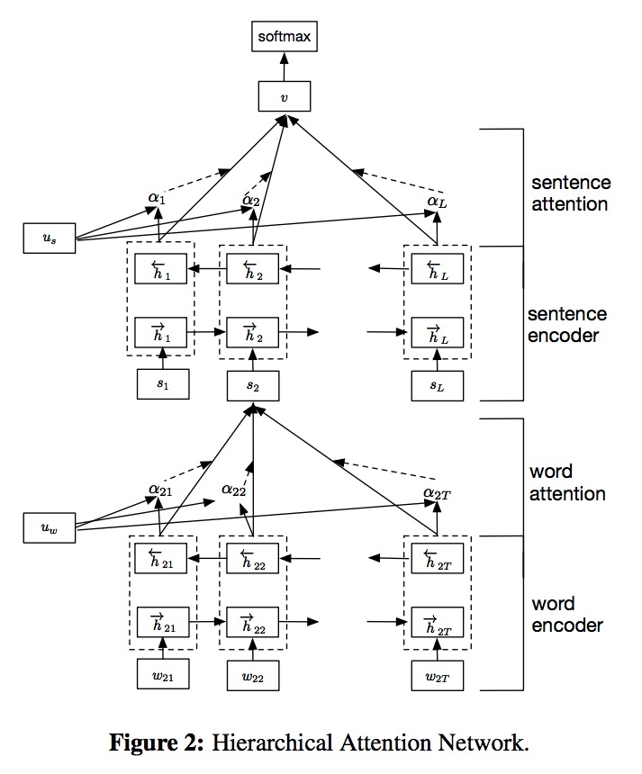
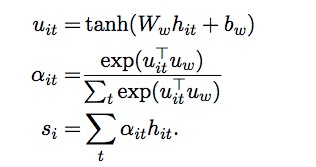

# 文本分类 -- HAN 模型

Hierarchical Attention Network (HAN) that is designed to capture two basic insights about document structure. First, since documents have a hierarchical structure (words form sentences, sentences form a document), we likewise construct a document representation by first building representations of sentences and then aggregating those into
a document representation. Second, it is observed that different words and sentences in a documents are differentially informative. Moreover, the importance of words and sentences are highly context dependent,
i.e. the same word or sentence may be differentially important in different context . 

HAN 的设计是用来捕获文档的两种结构。由于文档具有层次性，文档包含句子，句子包含词；HAN 首先提取句子的表达特征，然后将其聚合成文档的表达特征。

HAN 关注 document-level 级别的文档分类，它使用双向 GRU 对句子进行编码，在词和句子两个层面都添加了注意力机制。

### document-level

经过 GRU 编码后得到词的语义 $$h_{it}$$，然后将该语义通过一个 MLP 层，得到非线性转换后的语义$$u_{it}$$，然后通过$$u_{it}$$和 $$u_{w}$$ 的相似度计算词的重要性（相似性），经过 softmax 之后得到归一化的注意力权重 $$\alpha_{it}$$。词的上下文向量 $$u_{w}$$ 是随机初始化的，可以在训练中进行学习更新。

句子层面的编码和注意力机制类似。

