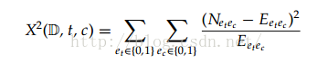
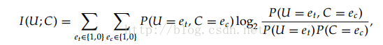
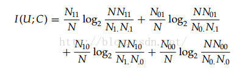

# 文本分类 -- 特征选择

## 1、TF-IDF
$$TF$$ 称为词频, 用于计算该词描述文档内容的能力；$$IDF$$ 称为逆文档频率, 用于计算该词区分文档的能力。$$TF*IDF$$ 的指导思想建立在这样一条基本假设之上: 在一个文本中出现很多次的单词, 在另一个同类文本中出现次数也会很多, 反之亦然。所以如果特征空间坐标系取TF 词频作为测度, 就可以体现同类文本的特点。另外还要考虑单词区别不同类别的能力,$$TF*IDF$$ 法认为一个单词出现的文本频率越小, 它区别不同类别的能力就越大, 所以引入了逆文本频度$$IDF$$ 的概念, 以$$TF$$ 和$$IDF$$ 的乘积作为特征空间坐标系的取值测度。

### 词频的计算

- 词频（TF） = 某个词在文章中的出现次数

由于文章有长短之分，为了便于不同文章的比较,需要做"词频"标准化。

- 词频（TF） = 某个词在文章中的出现次数 / 文章总词数

- 词频（TF） = 某个词在文章中的出现次数 / 拥有最高词频的词的次数

### 逆文档频率

- 逆文档频率（IDF） = log（语料库的文档总数/包含该词的文档总数+1）

分母加 1 的原因在于确保分母不为0.

TF-IDF算法中并没有体现出单词的位置信息，对于Web文档而言，权重的计算方法应该体现出HTML的结构特征。特征词在不同的标记符中对文章内容的反映程度不同，其权重的计算方法也应不同。因此应该对于处于网页不同位置的特征词分别赋予不同的系数，然后乘以特征词的词频，以提高文本表示的效果。

## 词频

词频是一个词在文档中出现的次数。通过词频进行特征选择就是将词频小于某一阈值的词删除，从而降低特征空间的维数。这个方法是基于这样一个假设，即出现频率小的词对过滤的影响也较小。但是在信息检索的研究中认为，有时频率小的词含有更多的信息。因此，在特征选择的过程中不宜简单地根据词频大幅度删词。

## 文档频数

文档频数(Document Frequency, DF)是最为简单的一种特征选择算法,它指的是在整个数据集中有多少个文本包含这个单词。在训练文本集中对每个特征计一算它的文档频次，并且根据预先设定的阑值去除那些文档频次特别低和特别高的特征。文档频次通过在训练文档数量中计算线性近似复杂度来衡量巨大的文档集，计算复杂度较低，能够适用于任何语料，因此是特征降维的常用方法。在训练文本集中对每个特征计算它的文档频数,若该项的DF 值小于某个阈值则将其删除,若其DF 值大于某个阈值也将其去掉。因为他们分别代表了“没有代表性”和“没有区分度”两种极端的情况。DF 特征选取使稀有词要么不含有用信息,要么太少而不足以对分类产生影响,要么是噪音,所以可删去。DF 的优点在于计算量小， 速度快,它的时间复杂度和文本数量成线性关系,所以非常适合于超大规模文本数据集的特征选择。不仅如此,文档频数还非常地高效,在有监督的特征选择应用中当删除90%单词的时候其性能与信息增益和x2 统计的性能还不相上下。但如果某一稀有词条主要出现在某类训练集中,却能很好地反映类别的特征,而因低于某个设定的阈值而滤除掉，包含着重要的判断信息被舍弃，这样就会对分类精度有一定的影响。

## 卡方检验

卡方检验 $$\chi ^2 test$$，是一种常用的特征选择方法，尤其是在生物和金融领域。$$\chi ^2 test$$ 用来描述两个事件的独立性或者说描述实际观察值与期望值的偏离程度。$$\chi ^2$$值越大，则表明实际观察值与期望值偏离越大，也说明两个事件的相互独立性越弱。



### 例子

现在有一个生物学问题，我们需要从采样的5个基因 gene1,…,gene4 中找到某种疾病的1个致病基因。下表我们分别统计了患病和不患病人群5种基因的出现频率。当我们把一种基因看做一种特征的时候，找到致病基因就可以看做是选择一种特征使得患病-不患病的二分类问题准确率最高。

|| gene1 |gene2|gene3 | gene4|
|--- | --- | --- |--- |--- |
|患病 | 0.73 | 0.24| 0.21| 0.54|
|不患病|0.71| 0.26 | 0.87 | 0.55|

首先，我们**做出假设 “患病与gene_x无关”**

```
以gene1为例，分布比较稳定，\chi ^2 值应该比较小，即两事件相互独立性比较强，即假设成立。
再以gene3为例，分布偏差很大，\chi ^2 值应该很大，即两事件相互独立性很弱，即假设不成立，因此最后我们选择gene3作为致病基因。
```
接下来我们讲怎样具体地计算 $$\chi ^2$$ 值。

先直接上公式：

$$X^2(t,c) = 
\sum_{e_t \in { 0,1 } } 
\sum_{e_c \in { 0,1 } } 
\frac{(N_{e_t e_c}-E_{e_t e_c})^2}{E_{e_t e_c}}$$

其中$$t$$，即某个特征有或无，$$c$$ ,即类别1或0(这里只支持2分类)。$$N$$ 是观察值， $$E$$ 是期望值。则 $$E_{11}$$ 表示出现特征 $$t$$ 且类别 $$c=1$$。

现在，我们以第一节中的 gene3 为例，来计算$$\chi ^2$$值，当然按照公式我们首先应该计算各种期望和观测值。首先，我们来虚构一个完整的患病-基因数据集。假如我们记录了10个人的gene3出现情况，得到类似于下面的表格:

|样本编号|gene3是否出现|是否患病|
|---|---|---|
|1	|1	|0|
|2	|1|	0|
|3	|1	|1|
4	|1|0|
5|1|	0|
6|	0|	1|
7|	1|	0|
8|	0|	1|
9|	1|	0|
10|	0|	1|

据此我们可以很容易的计算所有的观测值以及期望值。

首先是观测值

$$N_{11} = 患病且出现gene3的人数=1$$

$$N_{01} = 患病且不出现gene3的人数=3$$

$$N_{10} = 不患病出现gene3的人数=6$$

$$N_{00} = 不患病不出现gene3的人数=0$$

然后是期望值：(因为我们的假设是 t 和 c 独立，因此可以直接按照下式计算)

$$E_{11} = 10\times P(t=1)\times P(c=1)=2.8$$

$$N_{01} = 10\times P(t=0)\times P(c=1)=1.2$$

$$N_{10} = 10\times P(t=1)\times P(c=0)=4.2$$

$$N_{00} = 10\times P(t=0)\times P(c=0)=1.8$$

代入公式有：

$$X^2(t,c) = \frac{(1-2.8)^2}{2.8} + \frac{(3-1.2)^2}{1.2} + \frac{(6-4.2)^2}{4.2} + \frac{(0-1.8)^2}{1.8} = 6.4286 $$

我们已经得到了$$\chi ^2$$ 值，但是这并不够直接明了的说明问题。因此，我们还需要将 $$\chi ^2$$值转化为 p-value。p-value是一种给定原假设为真时样本结果出现的概率，我们可以通过简单查表来进行转化。如下表：自由度=1时的转化表格。（自由度=分类数-1，因此这里自由度=1.）

|p-value|	$$\chi ^2$$|
|---|---|
|0.1	|2.71|
|0.05|	3.84|
|0.01|	6.63|
|0.005| 7.88|
|0.001	|10.83|

我们的$$\chi^2$$值为 6.4286，转化为p-value约为 0.01，意思是假设患病和gene3无关的情况下，只有约 0.01 的概率会出现这样的样本结果。因此，我们就有约 0.99 的概率认为原假设错误，则 gene3 与患病有关。

## 互信息

互信息是用来评价一个事件的出现对于另一个事件的出现所贡献的信息量，具体的计算公式为：



其中U、C 代表两个事件，e 的取值可以为 0 或者 1，1 代表出现这个事件，0 代表不出现。

把上述公式拆解为统计形式为：



其中$$N_{11}$$是表示全部数据中两个事件同时出现的概率，N 表示全部事件出现的次数，而$$N_{0.}$$则表示 $$N_{01}+N_{00}$$。

实际做单特征选择的时候，我们把某个特征是否出现和分类是否正确这两个事件放在一起计算。把得分较高的特征进行保留。

需要注意的是计算时会遇到四种情况也就是，10,11,01,00，对于其中的某一种情况，当计算得到的值是0 时，代表了两者没有关联，当计算出的值是正值时，表示两者共同出现的概率比较高，当值为负时，表示两者是负相关。例如：00 情况是负值是，表示两者互相排斥，出现A时，B出现的概率就比较小，这个时候往往01情况和10情况的值为正（check）

**卡方检验对于出现次数较少的特征更容易给出高分。例如某一个特征就出现过一次在分类正确的数据中，则该特征会得到相对高的分数，而互信息则给分较低。其主要原因还是由于互信息在外部乘上了一个该类型出现的概率值，从而打压了出现较少特征的分数。**