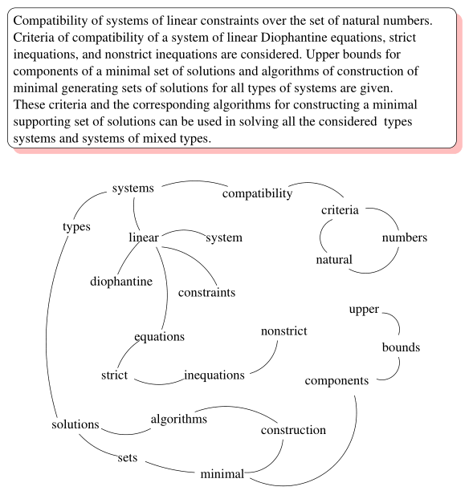

# 文本自动摘要 -- 抽取式算法

自动提取文档摘要的算法，主流方法分为两类：Extractive 抽取式、Abstractive 概要式。抽取式摘要是指从原始文档集中抽取一些具有代表性的文本片段构成摘要，这些片段可以是整个文档中的句子、子句、段落或者小节。

抽取式方法有两个问题，如何对文本单元排序打分；如何抽取文本单元的一个子集生成摘要。分别对应着排序单元和抽取单元。

通俗讲就是，先用排序单元把文档中的单元进行重要性排序，选择排名靠前的单元，再用抽取单元去除选出来的单元之间的冗余信息，得到最后的自动摘要。

目前主要方法有：

- 基于统计：统计词频，位置等信息，计算句子权值，再简选取权值高的句子作为文摘，特点：简单易用，但对词句的使用大多仅停留在表面信息。
- 基于图模型：构建拓扑结构图，对词句进行排序。例如，TextRank/LexRank
- 基于潜在语义：使用主题模型，挖掘词句隐藏信息。例如，采用LDA，HMM
- 基于整数规划：将文摘问题转为整数线性规划，求全局最优解。

## ILP（基于整数规划）

ILP 是一种常用的用来抽取摘要的算法，它能够尽可能的去除冗余。假设有：

- 排序单元（句子或概念）$$x_i$$；
- 排序函数 $$f(x_i)$$；
- 抽取单元 $$u_j$$，即句子，$$||u_j||$$ 便是 $$u_j$$ 中单词的个数；
- 指示变量 $$z_j^x$$，表明排序单元 $$x_i$$ 是否出现在摘要中；
- 指示变量 $$z_j^u$$，表示抽取单元 $$u_j$$ 是否包含在摘要中；
- 二元常量 $$I(i,j)$$，表示 $$x_i$$ 是否狐仙在 $$u_j$$ 中； 
- $$L$$ 表示摘要长度限制；
- $$sim(x_i,x_j)$$ 用来处理冗余的相似性度量；
- $$\delta $$ 表示冗余阈值

那么我们可以使用以下式子来进行整数规划运算，进行抽取摘要：

$$
max \Bigg\{ \sum_i f(x_i) * z_j^x \Bigg\}\\
s.t \ \sum_j z_j^u *|u_j| \leq L \\
\sum_j z_j^u * I(i,j) \geq z_i^x ,\ 对任意 i \\
(z_i^x+ z_j^x) *sim(x_i, x_j) < \delta \ 对任意 \ i,j \\
z_i^x, z_j^u \in \{0,1\}, \ 对任意 \ i,j
$$ 

上式中第一个公式约束摘要的长度；第二个公式是一致性约束，它保证如果摘要包含排序单元 $$x_i$$ 则该摘要必须包含至少一个函数 $$x_i$$ 的抽取单元；第三个约束考虑冗余去除，如果排序单元是句子，则 $$sim(x_i,x_j)$$ 表示句子之间的相似度，此时该约束表示如果两个句子的相似度大于 $$\frac{\delta }{2}$$ ，则他们不能同时出现在摘要中，如果排序单元是概念，则相似度公式为：

$$sim(x_i,x_j) = \begin{cases} 
1, \quad x_i = x_j\\
0, \quad otherwise
\end{cases} $$

求解上面的整数规划，我们就可以得到哪些句子是需要抽取出来，组成摘要的。

## TextRank

### TextRank 提取关键词

TextRank 算法源于 PageRank 算法，可以用来丛关键词提取，也可以用来做文本的自动摘要。TextRank 思想非常简单：通过词之间的相邻关系构建网络，然后用 PageRank 迭代计算每个节点的rank值，排序rank值即可得到关键词。PageRank本来是用来解决网页排名的问题，网页之间的链接关系即为图的边，迭代计算公式如下：

$$PR(V_i) = (1-d)+d* \sum _{j \in In(V_i)} \frac{1}{|Out(V_j)|} PR(V_j)$$

其中，$$PR(V_i)$$ 表示结点 $$V_i$$ 的 rank 值，$$In(V_i)$$ 表示结点 $$V_i$$ 的前驱结点集合，$$Out(V_j)$$ 表示结点 $$V_j$$ 的后继结点集合，d 为阻尼因子，用于做平滑,取值范围为 0 到 1, 代表从图中某一特定点指向其他任意点的概率, 一般取值为 0.85。

那么怎么把一个句子（可以看作词的序列）构建成图呢？TextRank将某一个词与其前面的N个词、以及后面的N个词均具有图相邻关系（类似于N-gram语法模型）。具体实现：设置一个长度为N的滑动窗口，所有在这个窗口之内的词都视作词结点的相邻结点；则TextRank构建的词图为无向图。下图给出了由一个文档构建的词图（去掉了停用词并按词性做了筛选）：

考虑到不同词对可能有不同的共现（co-occurrence），TextRank将共现作为无向图边的权值。那么，TextRank的迭代计算公式如下：

$$WS(V_i) = (1-d)+d* \sum _{j \in In(V_i)} \frac{1}{|Out(V_j)|} WS(V_j)$$

**若原文本中存在若干个关键词相邻的情况，那么这些关键词可以构成一个关键短语**。 例如，在一篇介绍 “支持向量机” 的文章中，可以找到三个关键词支持、向量、机，通过关键短语提取，可以得到支持向量机。 

### TextRank 提取摘要

构建图 $$G =（V,E）$$，其中 $$V$$ 为句子集，$$E$$ 为边集。将每个句子看成图中的一个节点，若两个句子之间有相似性，认为对应的两个节点之间有一个无向有权边，权值是相似度。采用如下公式进行计算句子的相似性：

$$Similarity(S_i,S_j) = \frac{\{w_k| (w_k \in S_i) \bigcap ( w_k \in S_j)\}}{log(|S_i|) + log(||S_j)}$$

也就是将两个句子的共有词的个数除以两个句子的对数和，可以看到这种相似度计算方法**只考虑了句子的字面相似度**。若两个句子之间的相似度大于给定的阈值，就认为这两个句子语义相关并将它们连接起来。

迭代公式和计算关键词的迭代公式一样。经过迭代之后，得到句子重要性的排序列表，然后直接将排在前 k 个句子按原来的顺序输出就得到摘要了，可以看到原始的 TextRank 算法并没有考虑对摘要进行冗余信息去重。

## TextTeaser

TextTeaser 摘要算法是属于基于统计的摘要算法。基本的统计指标有：

1. 句子长度，长度为某个长度的句子为最理想的长度，依照距离这个长度的远近来打分。
2. 句子位置，根据句子在全文中的位置，给出分数。（比如每段的第一句是核心句的比例大概是70%）
3. 句子是否包含标题词，根据句子中包含标题词的多少来打分。
4. 句子关键词打分，文本进行预处理之后，按照词频统计出排名前10的关键词，通过比较句子中包含关键词的情况，以及关键词分布的情况来打分。 

综合上述3步的打分做累加，然后倒排得到每个句子的重要性得分，此时要考虑到摘要的可读性，通俗的做法是按照句子在文章中出现的顺序来输出。

排序之后的结果只考虑了相关性并没有考虑新颖性，非常有可能出现排名靠前的几句话表达的都是相似的意思。所以需要引入一个惩罚因子，将新颖性考虑进去。对所有的句子重新打分，如下公式： 

$$score(i) = a * score(i) + (1-a) * similarity(i,i-1), \ i = 2,3,…,N $$

序号 i 表示排序后的顺序，从第二句开始，排第一的句子不需要重新计算，后面的句子必须被和前一句的相似度进行惩罚。
 
句子的相似性算法有很多，比如比较常用的BM25法算法。

## 总结

上面讲的摘要算法几乎都需要对句子进行相似度计算，但是由于这些算法提出的年代比较久远，因此在相似度计算方面都智能做到字面意思上的计算，只有使用基于 LDA 的算法才会考虑到浅层的语义相关性；现在拿过来重新使用的话，我们可以将词向量考虑进去，比如将句子表示成词向量的加权平均，加权可以使用词的 tf-idf 权重。

另外一方面将上述算法结合起来也不失为一个号方法。

