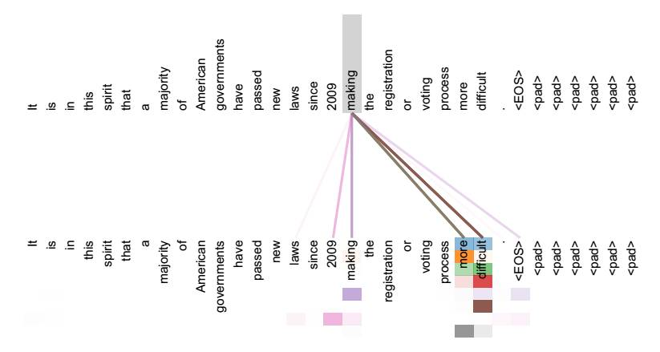
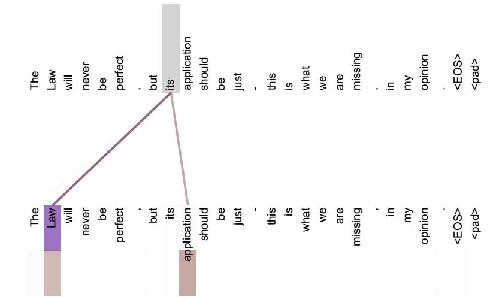

# 注意力机制 Attention Mechanism

本文介绍一下注意力机制在 NLP 中的应用。

注意力机制的直觉是：人类视觉通过快速扫描全局图像，获得需要重点关注的目标区域，也就是一般所说的注意力焦点，而后对这一区域投入更多注意力资源，以获取更多所需要关注目标的细节信息，而抑制其他无用信息。这是人类**利用有限的注意力资源从大量信息中快速筛选出高价值信息的手段**，是人类在长期进化中形成的一种生存机制，人类视觉注意力机制极大地提高了视觉信息处理的效率与准确性。

## Encoder-Decoder框架

许多注意力机制的应用都依附于 Encoder-Decoder 框架，因此首先了解一下 Encoder-Decoder框架也是必要的。当然注意力作为一种通用的思想，它并不仅仅依赖特定的框架。

如上图所示，该框架是文本处理领域常用的 Encoder-Decoder 框架，我们可以将左侧看做输入，右侧看做输出，输入输出都是句子，我们可以将他们表示为句子对 $$<source,target>$$。那么神经网络是如何将 source 变为 target 呢？其实就是 Encoder-Decoder 的过程了，首先将输入进行编码（encoder），得到中间的语义编码，最后将语义编码进行解码（decoder）从而得到输出。Source和Target可以是同一种语言，也可以是两种不同的语言。而Source和Target分别由各自的单词序列构成，使用公式表示如下所示：

$$source=<x_1,x_2,...,x_m>$$

$$target = <y_1,y_2,...,y_n>$$

语义编码，将输出转化成中间语义表示 C：

$$C = F(x_1,x_2,...,x_m)$$

语义解码，将中间语义表示和历史信息 $$y_1,y_2,..,y_{i-1}$$ 来生成 i 时刻生成的单词 $$y_i$$：

$$y_i = G(C,y_1,y_2,...,y_{i-1})$$

每个yi都依次这么产生，那么看起来就是整个系统根据输入句子Source生成了目标句子Target。如果Source是中文句子，Target是英文句子，那么这就是解决机器翻译问题的Encoder-Decoder框架；如果Source是一篇文章，Target是概括性的几句描述语句，那么这是文本摘要的Encoder-Decoder框架；如果Source是一句问句，Target是一句回答，那么这是问答系统或者对话机器人的Encoder-Decoder框架。由此可见，在文本处理领域，Encoder-Decoder的应用领域相当广泛。

一般而言，文本处理和语音识别的Encoder部分通常采用RNN模型，图像处理的Encoder一般采用CNN模型。

**然而，可以看到，在解码的时候，不管生成哪个时刻的 yi ，使用的都是相同的中间语义 C，显然这有缺陷的。比如在翻译模型中，将 “Tom chase Jerry” 进行翻译，Encoder-Decoder框架逐步生成中文单词：“汤姆”，“追逐”，“杰瑞” ，模型里面的每个英文单词对于翻译目标单词“杰瑞”贡献是相同的，很明显这里不太合理，显然 “Jerry” 对于翻译成 “杰瑞” 更重要，但是一般模型是无法体现这一点的。**

## Attention 模型

### Soft Attention模型

没有引入注意力的模型在输入句子比较短的时候问题不大，但是如果输入句子比较长，此时所有语义完全通过一个中间语义向量来表示，单词自身的信息已经消失，可想而知会丢失很多细节信息，这也是为何要引入注意力模型的重要原因。

在上节最后的例子中，如果引入Attention 机制的话，应该在翻译“杰瑞”的时候，体现出英文单词对于翻译当前中文单词不同的影响程度，比如给出类似下面一个概率分布值：

（Tom,0.3）(Chase,0.2) (Jerry,0.5)

每个英文单词的概率代表了翻译当前单词“杰瑞”时，注意力分配模型分配给不同英文单词的注意力大小。这对于正确翻译目标语单词肯定是有帮助的，因为引入了新的信息。同理，目标句子中的每个单词都应该学会其对应的源语句子中单词的注意力分配概率信息。这意味着在生成每个单词 $$y_i$$ 的时候，原先都是相同的中间语义表示 C 会被替换成根据当前生成单词而不断变化的 $$C_i$$ 。理解 Attention 模型的关键就是这里，即由固定的中间语义表示 C 换成了根据当前输出单词来调整成加入注意力模型的变化的 $$C_i$$。增加了注意力模型的Encoder-Decoder框架理解起来如下图所示。

加入注意力之后，生成目标句子单词的过程成了如下的形式：

$$
\begin{align}
y_1 &= f1(C_1) \\
y_2 &= f1(C_2,y_1) \\
y_1 &= f1(C_3,y_1,y_2)
\end{align}
$$

每个中间语义表示 $$C_i$$ 对应着不同源语句子单词的注意力分配概率分布。

其中，f2 函数代表 Encoder 对输入英文单词的某种变换函数，比如如果 Encoder 是用的RNN 模型的话，这个 f2 函数的结果往往是某个时刻输入 $$X_i$$ 后隐层节点的状态值；g 代表 Encoder 根据单词的中间表示合成整个句子中间语义表示的变换函数，一般的做法中，g函数就是对构成元素加权求和，即下列公式：

$$C_i = \sum _{j=1}^{L_x} \alpha _{ij} h_j$$

其中，$$L_x$$ 代表输入句子Source 的长度，$$\alpha _{ij}$$ 代表在 Target 输出第 i 个单词时 Source 输入句子中第 j 个单词的注意力分配系数，而 $$h_j$$ 则是Source 输入句子中第 j 个单词的语义编码。假设 $$C_i$$ 下标 i 就是上面例子所说的“ 汤姆” ，那么 $$L_x$$ 就是 3，h1=f(“Tom”)，h2=f(“Chase”),h3=f(“Jerry”)分别是输入句子每个单词的语义编码，对应的注意力模型权值则分别是0.6,0.2,0.2，所以 g 函数本质上就是个**加权求和函数**。如果形象表示的话，翻译中文单词“汤姆”的时候，数学公式对应的中间语义表示 $$C_i$$ 的形成过程类似图4。

那么，**生成目标句子某个单词，比如“汤姆”的时候，如何知道Attention模型所需要的输入句子单词注意力分配概率分布值呢？** 我们看看下图：

对于采用 RNN 的 Decoder 来说，在时刻 i，如果要生成 yi 单词，我们是可以知道 Target在生成 $$y_i$$ 之前的时刻 i-1 时，隐层节点 i-1 时刻的输出值 $$H_{i-1}$$ 的，而我们的目的是要计算生成 $$y_i$$ 时输入句子中的单词 “Tom”、 “Chase”、 “Jerry” 对 $$y_i$$ 来说的注意力分配概率分布，那么可以用 Target 输出句子 i-1 时刻的隐层节点状态 $$H_{i-1}$$ 去一一和输入句子 Source 中每个单词对应的RNN隐层节点状态 hj 进行对比，即通过函数 $$F(h_j,H_{i-1})$$ 来获得目标单词 $$y_i$$ 和每个输入单词对应的对齐可能性，这个 $$F$$ 函数在不同论文里可能会采取不同的方法，然后函数 $$F$$ 的输出经过 Softmax 进行归一化就得到了符合概率分布取值区间的注意力分配概率分布数值。

绝大多数 Attention 模型都是采取上述的计算框架来计算注意力分配概率分布信息，区别只是在 $$F$$ 的定义上可能有所不同。

**上述内容就是经典的 Soft Attention 模型的基本思想**

## Attention 机制的本质思想

如果把Attention机制从上文讲述例子中的Encoder-Decoder框架中剥离，并进一步做抽象，可以更容易看懂Attention机制的本质思想。

如上图所示：将 Source 中的构成元素想象成是由一系列的 <Key,Value> 数据对构成，此时给定 Target 中的某个元素 Query，通过计算 Query 和各个 Key 的相似性或者相关性，得到每个 Key 对应 Value 的权重系数，然后对 Value 进行加权求和，即得到了最终的Attention 数值。所以本质上 Attention 机制是对 Source 中元素的 Value 值进行加权求和，而 Query 和 Key 用来计算对应 Value 的权重系数。即可以将其本质思想改写为如下公式：

$$Attention(Query, Source)=\sum _{i=1}^{L_x} Similarity(Query,key_i)*Value_i $$

其中，Lx = ||Source||代表 Source 的长度，公式含义即如上所述。上文所举的机器翻译的例子里，因为在计算Attention的过程中，Source 中的 Key 和 Value 合二为一，指向的是同一个东西，也即输入句子中每个单词对应的语义编码，所以可能不容易看出这种能够体现本质思想的结构。

当然，从概念上理解，把 Attention 仍然理解为从大量信息中有选择地筛选出少量重要信息并聚焦到这些重要信息上，忽略大多不重要的信息，这种思路仍然成立。聚焦的过程体现在权重系数的计算上，权重越大越聚焦于其对应的 Value 值上，即权重代表了信息的重要性，而Value是其对应的信息。

至于Attention机制的具体计算过程，如果对目前大多数方法进行抽象的话，可以将其归纳为两个过程：第一个过程是根据Query和Key计算权重系数，第二个过程根据权重系数对Value进行加权求和。而第一个过程又可以细分为两个阶段：第一个阶段根据Query和Key计算两者的相似性或者相关性；第二个阶段对第一阶段的原始分值进行归一化处理；这样，可以将Attention的计算过程抽象为如下图展示的三个阶段。

在第一个阶段，可以引入不同的函数和计算机制，根据 Query 和某个 $$key_i$$，计算两者的相似性或者相关性，最常见的方法包括：求两者的向量点积、求两者的向量Cosine相似性或者通过再引入额外的神经网络来求值，即如下方式：

点积：$$Similarity(Query,key_i) = Query \cdot  key_i$$

余弦相似性：$$Similarity(Query,key_i) = \frac{Query \cdot  key_i}{||Query ||\cdot ||key_i||}$$

MLP 网络：$$Similarity(Query,key_i) = MLP(Query,key_i)$$

第一阶段产生的分值根据具体产生的方法不同其数值取值范围也不一样，第二阶段引入类似SoftMax的计算方式对第一阶段的得分进行数值转换，一方面可以进行归一化，将原始计算分值整理成所有元素权重之和为1的概率分布；另一方面也可以通过SoftMax的内在机制更加突出重要元素的权重。即一般采用如下公式计算：

$$\alpha _i = Softmax(Sim_i) = \frac{e^{Sim_i}}{\sum_{j=1} ^{L_x} e^{Sim_j}}$$

第二阶段的计算结果 $$\alpha_i$$ 即为 $$Value_i$$ 对应的权重系数，然后进行加权求和即可得到 Attention 数值：

$$Attention(Query, Source)=\sum _{i=1}^{L_x} \alpha_i \cdot Value_i$$

通过如上三个阶段的计算，即可求出针对 Query 的 Attention 数值，目前绝大多数具体的注意力机制计算方法都符合上述的三阶段抽象计算过程。

### Self Attention 机制

通过上述对 Attention 本质思想的梳理，我们可以更容易理解本节介绍的 Self Attention模型。Self Attention 也经常被称为 intra Attention（内部Attention），最近一年也获得了比较广泛的使用，比如 Google 最新的机器翻译模型内部大量采用了 Self Attention 模型。

在一般任务的 Encoder-Decoder 框架中，输入 Source 和输出 Target 内容是不一样的，比如对于英-中机器翻译来说，Source 是英文句子，Target 是对应的翻译出的中文句子，Attention 机制发生在 Target 的元素 Query 和 Source 中的所有元素之间。而Self Attention 顾名思义，指的不是 Target 和 Source 之间的 Attention 机制，而是 Source 内部元素之间或者 Target 内部元素之间发生的 Attention 机制，也可以理解为 Target=Source 这种特殊情况下的注意力计算机制。其具体计算过程是一样的，只是计算对象发生了变化而已，所以此处不再赘述其计算过程细节。

如果是常规的 Target 不等于 Source 情形下的注意力计算，其物理含义正如上文所讲，比如对于机器翻译来说，本质上是目标语单词和源语单词之间的一种单词对齐机制。那么如果是 Self Attention 机制，一个很自然的问题是：通过 Self Attention 到底学到了哪些规律或者抽取出了哪些特征呢？或者说引入 Self Attention 有什么增益或者好处呢？我们仍然以机器翻译中的 Self Attention 来说明，下面两图是可视化地表示 Self Attention 在同一个英语句子内单词间产生的联系。

从两张图可以看出，Self Attention 可以捕获同一个句子中单词之间的一些句法特征（比如第一个图展示的有一定距离的短语结构）或者语义特征（比如图2展示的 its 的指代对象 Law）。

很明显，引入 Self Attention 后会更容易捕获句子中长距离的相互依赖的特征，因为如果是RNN 或者 LSTM，需要依次序序列计算，对于远距离的相互依赖的特征，要经过若干时间步步骤的信息累积才能将两者联系起来，而距离越远，有效捕获的可能性越小。

但是 Self Attention 在计算过程中会直接将句子中任意两个单词的联系通过一个计算步骤直接联系起来，所以远距离依赖特征之间的距离被极大缩短，有利于有效地利用这些特征。除此外，Self Attention 对于增加计算的并行性也有直接帮助作用。这是为何 Self Attention 逐渐被广泛使用的主要原因。

## Tensorflow 中的 Attention 实现

 
