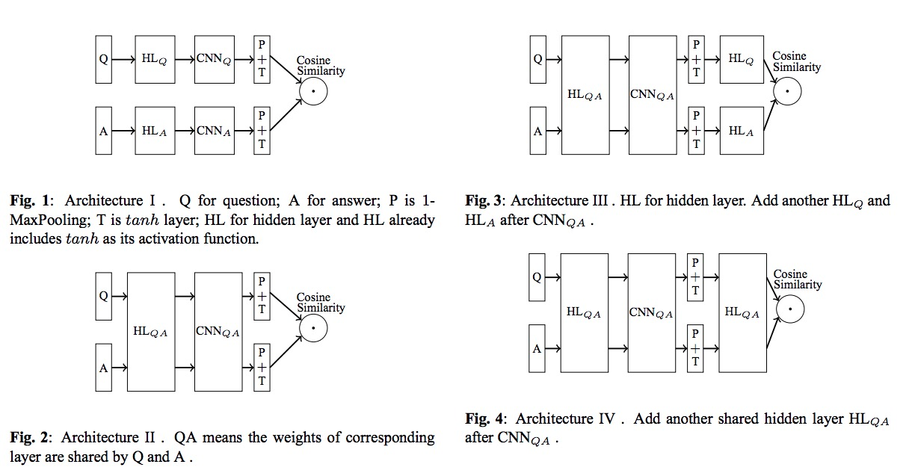
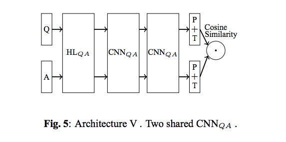
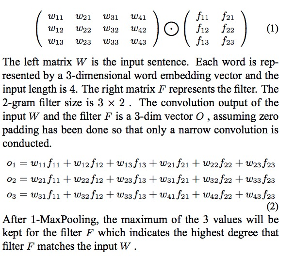
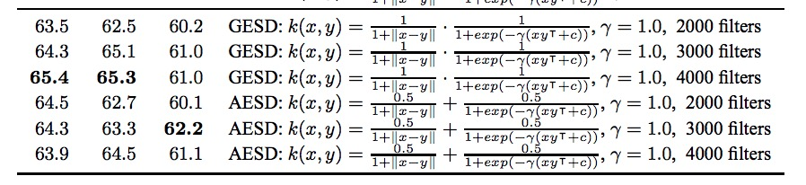

# 深度语义匹配模型系列 -- DLAS

APPLYING DEEP LEARNING TO ANSWER SELECTION: A STUDY AND AN OPEN TASK

给定一个问题 q 和一些候选回答集合，目的是在回答集合里面挑选一个最合适的回答。如果挑选的回答 a 在正确的回答集合中，则认为是挑选对了，反之认为挑选错误；从这个定义来说，问答匹配可以认为是一个二分类问题。

训练时，每一个样本有一个问题 Q，一个正例回答 $$A^+$$ 和一个负例回答（错误回答） $$A^—$$， 深度学习框架提取问题和两个回答的向量表达：$$V_Q, V_{A^+}, V_{A^\_}$$ , 计算问题和两个回答的余弦相似度，然后比较两个相似度的 margin：$$cos(V_Q, V_{A^+})-cos(V_Q, V_{A^\_}) < m $$，当上式条件满足时，表示模型的所提取的向量表达使得正例在负例之下，表明需要更新参数；反之，不需要更新参数。损失函数定义如下：

$$L = max\{0, m - cos(V_Q, V_{A^+}) + cos(V_Q, V_{A^\_})\} $$

在预测时，我们计算问题和候选答案的余弦相似度 $$cos(V_Q, V_{candidate})$$，$$V_{candidate}$$ 的维度为500维，余弦相似度最大的候选答案被选为正确答案。

### 网络结构

The hidden layer (HL) is defined as $$z = tanh(W x+B)$$. W is the weight matrix; $$B$$ is the bias vector; $$x$$ is input; $$z$$ is the output of the activation function $$tanh$$. The output then flows to the CNN layer $$CNN_Q$$, applied to extract question side features. $$P$$ is the MaxPooling layer (we always use 1-MaxPooling in this paper) and $$T$$ is the $$tanh$$ layer.

### 双层 CNN 结构

表3中的相似性可以分为三类：基于L1范数的度量，其是Q的语义距离和从每个坐标轴求和的A; 基于L2范数的度量，是Q和A的直线语义距离; 测量Q和A之间角度的基于内积的度量。我们提出了两个新的度量，它们通过乘法（欧几里德距离和Sigmoid点积的GESD几何平均值）和加法（欧几里德和Sigmoid 点积的AESD算术平均值）组合L2范数和内积）。这两个指标是所有比较指标中最好的。最后，在表3的底部，很明显，使用更多过滤器，建议的度量标准可以实现更好的性能。

框架2好于框架1的原因在于使用共享的卷积层，可以提取 Q和A 中相对应位置的语义向量都是同一个卷积核所提取的，保证了两个用来计算相似度的语义向量是在同一个语义空间。

