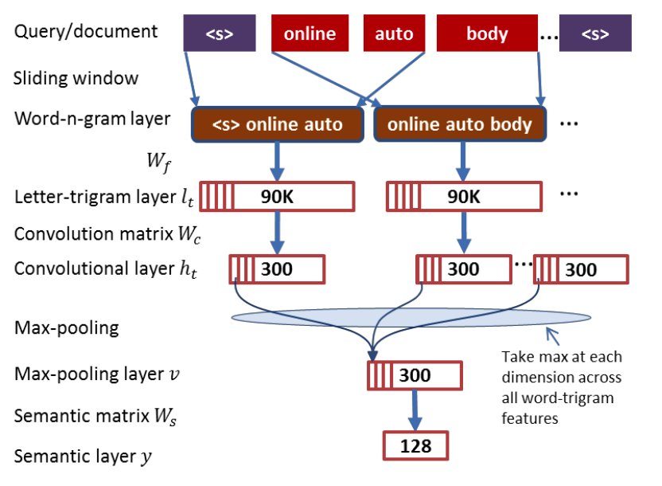
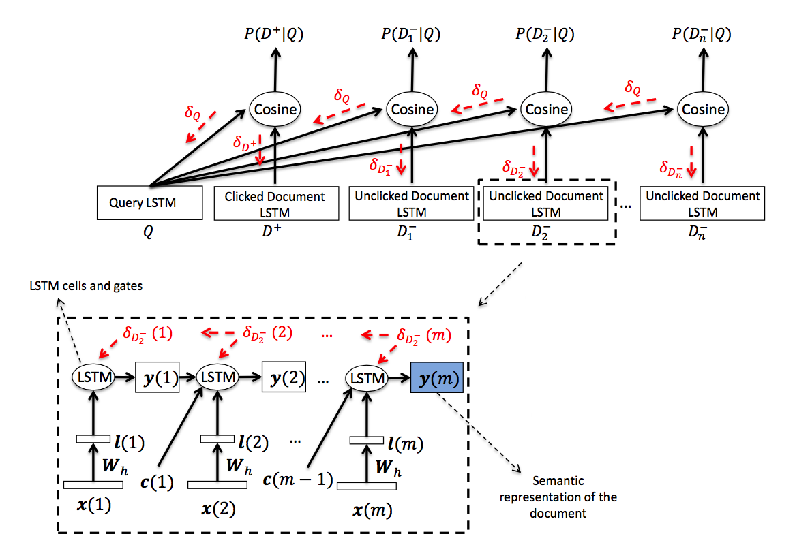

# 深度语义匹配模型系列 -- DSSM系列

Learning Deep Structured Semantic Models for Web Search using Clickthrough Data

### 1、DSSM

- 输入的是一个 query 和这个query相关的 doc ，这里的输入特征可以是最简单的 one-hot ,而需要 train 的是这个query下各个doc的相关性( DSSM里面使用点击率来代替相关性)。
- 文本以 one-hot 的方式编码作为输入，针对vocabulary 太大和 oov 问题，论文中做了 Word Hashinging 的操作。比如 good ，他可以写成 #good# ，然后按tri-grams来进行分解为 #go goo ood od# ，再将这个tri-grams灌入到 bag-of-word 中；3个字母的组合有限，容易枚举。
- 忽略了文本的上下文信息和一词多意、多义词的情况。

相关性计算公式：

$$P(D|Q) = \frac{exp(\gamma R(Q,D))}{\sum_{d_i \in D} exp(\gamma R(Q,D))}$$

最终他需要优化的损失函数为: 
$$L(\Lambda) = - \text{log} \prod_{(Q,D^+)} P(D^+|Q)$$

$$D^+$$ 表示被点击的文档，这里就是最大化点击文档的相关性的最大似然。

### 2、CDSSM

CDSSM 保持了语句的局部有序性

### 3、DSSM-LSTM 

既然是为了记录输入句子的上下文，这个无疑是 Lstm 这个模型更为擅长，因此又有了一种 Lstm 来构造的 DSSM 模型。

