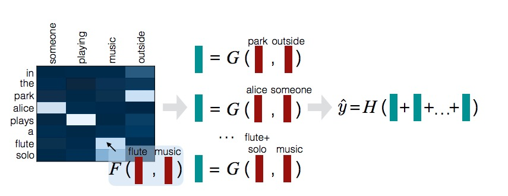

# 深度语义匹配模型系列--Decomposable Attention Model

论文提出的模型为解决自然语言推理的问题，自然语言推理（NLI）指的是确定前提和假设之间的蕴涵和矛盾关系的问题。本模型的特点是，模型参数少，但是精度高。

模型输入为两个匹配的句子和标签组成的三元组，假设输入语句1为 $$a = (a_1,a_2,..,a_{l_a})$$，语句2为 $$b = (b_1,b_2,..,b_{l_b})$$，$$l_a,l_b$$ 分别是两个句子的长度。$$a_i,b_i \in R^d$$，表示词向量的维度为 d ，每个句子使用 NULL 预先填充。标签 $$y^{(n)}=(y_1^{(n)},...,y_C^{(n)})$$ 表示标签，C 表示类别数。

模型的主要结构有三部分，分别是 Attend，Compare，Aggregate ，如下图所示：

## Attend

使用注意力机制的变体形式将两个句子 a,b进行软对齐（soft-align），然后将问题分解为对齐的子短语的比较。

首先使用$$F'$$ 函数计算未归一化的 attention 权重 $$e_{i,j}$$，可以使用 $$F$$ 函数来分解 $$F'$$ 函数 ，如下所示：

$$e_{i,j} := F'(\overline a_i, \overline b_i) := F(\overline a_i)^T F(\overline b_i)$$

这种分解将避免了 $$l_a * l_b$$ 的平方次复杂度，而仅仅需要 $$l_a + l_b$$ 的复杂度。这里 $$F$$ 函数是使用 relu 激活函数的前馈神经网络。

attention 权重归一化：

$$\beta _i := \sum _{j=1}^{l_b} \frac{exp(e_{i,j})}{\sum _{k=1}^{l_b} exp(e_{ik})} \overline b_j$$

$$\alpha _j := \sum _{i=1}^{l_a} \frac{exp(e_{i,j})}{\sum _{k=1}^{l_a} exp(e_{kj})} \overline a_i$$

这里 $$\beta _i$$ 是 $$\overline b$$ 中子短语和 $$ \overline a_i$$ 的对齐；同理 $$ \overline a_i$$。

## Compare

分别比较句子的每一个子短语和另外一个句子的子短语，使用前馈神经网络函数 G 对句子 a 生成一个向量集合 $$\{V_{1,i}\}_{i=1}^{l_a}$$，对 b 生成 $$\{V_{2,j}\}_{j=1}^{l_b}$$。每个 $$V_{1,i}$$ 指 $$a_i$$ 和它的软对齐的 b 中的短语之间的非线性组合；同理 $$V_{1,j}$$ 针对 $$b_i$$。

$$V_{1,i} := G([\overline a_i, \beta _i]) \  i \in [1,2,..,l_a]$$

$$V_{2,j} := G([\overline b_j, \alpha _j]) \  j \in [1,2,..,l_b]$$

这里 $$[.,.]$$ 表示向量的拼接。

## Aggregate

聚合 $$\{V_{1,i}\}_{i=1}^{l_a}$$，和 $$\{V_{2,j}\}_{j=1}^{l_b}$$，使用它们的结果作为预测标签。

得到两个向量比较集合 $$\{V_{1,i}\}_{i=1}^{l_a}$$、 $$\{V_{2,j}\}_{j=1}^{l_b}$$ 后 ，首先需要将每个集合的值进行加和：

$$V_1 = \sum _{i=1}^{l_a}V_{1,i}, \ V_2 = \sum _{j=1}^{l_b}V_{2,j}$$

然后将结果输入给分类器 H ，H 是一个前馈神经网络的线性层：

$$\overline y = H([V_1,V_2])$$

y 表示每个类别的得分，可以通过 softmax 给出属于每个类别的概率。训练时使用多分类交叉熵损失函数，如下：

$$L(\theta _F ,\theta _G,\theta _H) = \frac{1}{N}\sum _{n=1}^N \sum _{c=1}^C y_c ^{(n)} log \frac{exp(\overline y_c)}{\sum _{c'=1}^C exp(\overline y_{c'})}$$

## Intra-Sentence Attention

输入表达在普通版的设置中直接使用的是词向量，但是，我们可以通过 Intra-Sentence Attention 来改善这种输入表示，以编码每个句子中单词之间的成分关系。

$$f_{ij} := F_{intra}(a_i)^T F_{intra}(a_j)$$

这里 $$F_{intra}$$ 是前馈神经网络，根据上式，我们可以得到自对齐短语：

$$\alpha _i := \sum _{i=1}^{l_a} \frac{exp(f_{ij} + d_{i-j})}{\sum _{k=1}^{l_a} exp(f_{ik} + d_{i-k})} \overline a_j$$

这里  distance-sensitive 偏置项 $$d_{i-j} \in R $$ 为模型提供最少量的序列信息，同时保持可并行化。 这些词语的离散化，使得大于10个字的所有距离共享相同的偏差。输入表达由此被定义成 $$\overline a_i := [a_i, a'_i]$$，$$\overline b_i := [b_i, b'_i]$$

