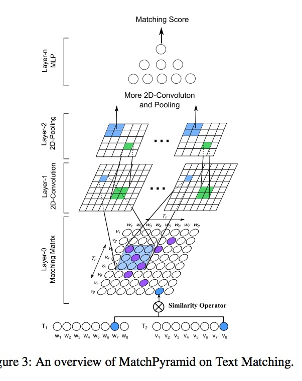
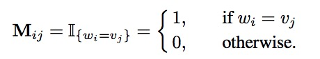
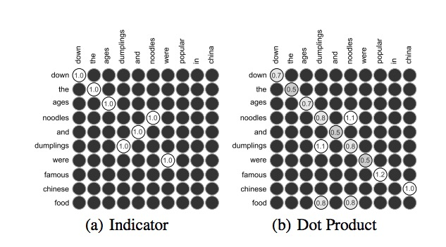
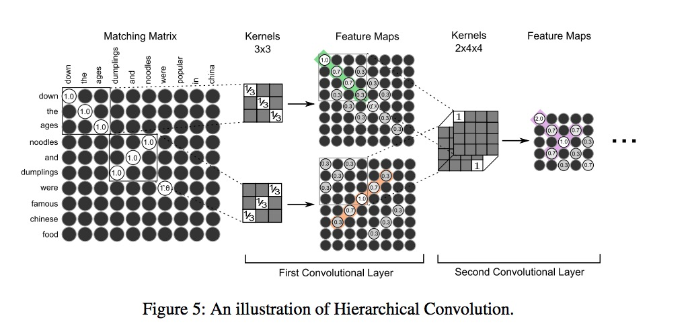
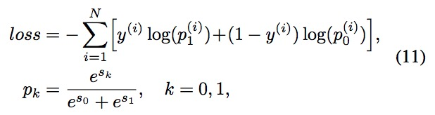
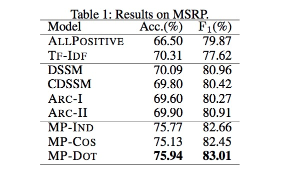
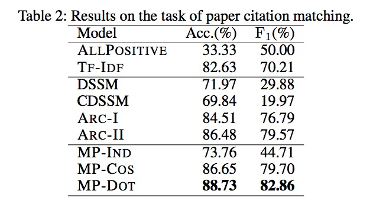

#深度语义匹配模型系列--MatchPyramid
Text Matching as Image Recognition

Liang Pang, Yanyan Lan, Jiafeng Guo

语义匹配算法需要捕获两个句子之中丰富的交互结构信息，比如词、短语和句子，以判断两个句子是否表达的是同一个句子。对于以下两句话，需要获取词的匹配 “down”，相似词的匹配 “famous” 和 “popular，n-gram 的匹配““down the age”，顺序不一致的 n-term 匹配 “ noodles and dumpling”和 ““dumplings and noodle”，以及语义相似的 n-gram 匹配 “were famous Chinese foo” 和 “were popular in Chin”。

```
T1 : Down the ages noodles and dumplings were famous Chinese food.
T2 : Down the ages dumplings and noodles were popular in China
```



为了让文本匹配可以像图像识别的方式一样使用卷积操作，作者将文本输入形式转换成匹配矩阵 M ，M 中的每个元素 $$M_{ij}$$ 表示基本的交互，比如词$$w_i$$ 和 $$v_j$$ 之间的相似度

$$M_{ij} = w_i \bigotimes v_j$$

通过这种方式 匹配矩阵 M 可以看做一张图像。$$\bigotimes $$ 可以使用不同的交互模型。比如知识函数 Indicator Function：



这种指示函数无法表达相似词的匹配，这对这一点，作者使用词向量来对词和词之间进行计算相似度，分别有使用余弦相似度和点乘。


由于相匹配的两个句子，在不同样本中长度不同，所以构建成的匹配矩阵 M 尺寸也不相等，因此使用动态池化操作策略来获取定长特征图。



### Matching Score and Training
$$(s_0,s_1)^T = W_2\sigma(W_1z+b_1)+b_2 $$


where $$s_0$$ and $$s_1$$ are the matching scores of the corresponding
class, $$z$$ is the output of the hierarchical convolution, $$W_i$$
is the weight of the $$i_{th}$$ MLP layer and $$\sigma $$ denotes the activation function.

损失函数如下所示：


It performs better when we use the mini-batch strategy (32∼50 in size),
which can be easily parallelized on single machine with multi-cores. For regularization, we find that some common strategies like early stopping (Giles 2001) and dropout (Hinton et al. 2012) are enough for our model.

There are three versions of MatchPyramid, depending on different methods used for constructing the matching matrices, denoted as MP-IND, MP-COS, and MP-DOT, respectively. All these models use **two convolutional layers**, **two max-pooling layers**(one of which is a dynamic pooling layer for variable length) and **two full connection layers**. The number of feature maps is 8 and 16 for the first and second convolutional layer, respectively. While the kernel size is set to be **5 × 5 and 3 × 3**, respectively. Unlike ARC-II which initiates with Word2Vec trained on Wikipedia, we **initiate the word vectors in MP-COS and MP-DOT randomly** from a unit ball. Thus our model do not require any external sources.

### Experiment I: Paraphrase Identification


### Experiment II: Paper Citation Matching
使用一些列的论文和它们的摘要，将论文的引文和摘要作为一对匹配。

```
T1 : this article describes pulsed thermal time of flight ttof flow 
sensor system as two subsystems pulsed wire system and heat flow system 
the entire flow sensor is regarded system theoretically as linear.

T2 : the authors report on novel linear time invariant lti modeling of
 flow sensor system based on thermal time of flight tof principle by 
 using pulsed hot wire anemometry thermal he at pulses.
```


