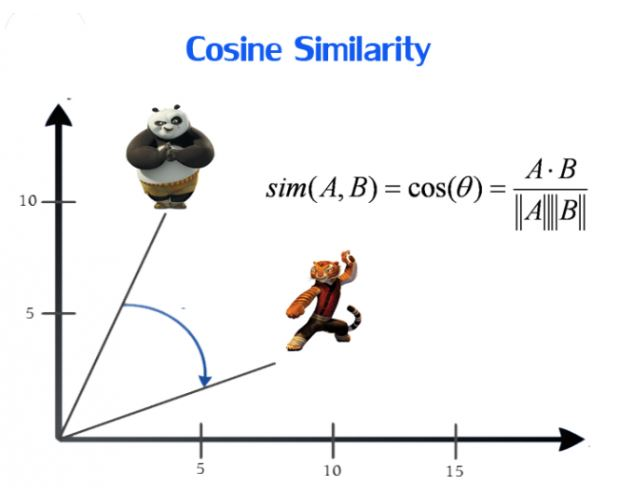
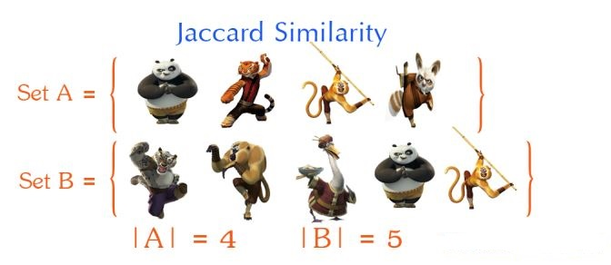
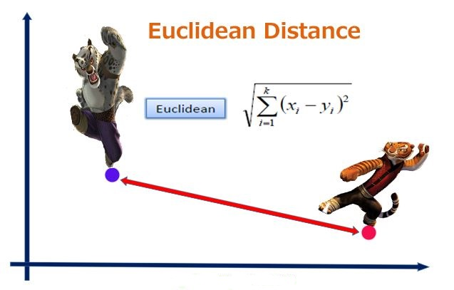

# 距离度量和相似度度量公式

### 相关系数

相关系数(Correlation coefficient) 是用以反映变量之间相关关系密切程度的统计指标。依据相关现象之间的不同特征，其统计指标的名称有所不同。如将反映两变量间线性相关关系的统计指标称为相关系数(相关系数的平方称为判定系数);将反映两变量间曲线相关关系的统计指标称为非线性相关系数、非线性判定系数;将反映多元线性相关关系的统计指标称为复相关系数、复判定系数等。

协方差：$$Cov(x,y)=\frac{\sum_{i=1}^n(x_i- \overline x)(y_i - \overline y)}{n}$$

皮尔逊相关系数 $$p = \frac{Cov(x,y)}{\sigma _ x \sigma _y}$$

$$p = \frac{\sum_{i=1}^n(x_i- \overline x)(y_i - \overline y)}{\sqrt{\sum_{i=1}^n(x_i- \overline x)^2}\sqrt{\sum_{i=1}^n(y_i- \overline y)^2}}$$

相关系数有一个明显的缺点，即它接近于1的程度与数据组数 n 相关，这容易给人一种假象。因为，当 n 较小时，相关系数的波动较大，对有些样本相关系数的绝对值易接近于1;当n较大时，相关系数的绝对值容易偏小。特别是当 n=2 时，相关系数的绝对值总为1。因此在样本容量 n 较小时，我们仅凭相关系数较大就判定变量 x 与 y 之间有密切的线性关系是不妥当的。

### 余弦相似度 Cosine Similarity

余弦相似度用向量空间中两个向量夹角的余弦值作为衡量两个个体间差异的大小。相比距离度量，余弦相似度更加注重两个向量在方向上的差异，而非距离或长度上。 

### Jaccard Similarity
Jaccard系数主要用于计算符号度量或布尔值度量的个体间的相似度，因为个体的特征属性都是由符号度量或者布尔值标识，因此无法衡量差异具 体值的大小，只能获得“是否相同”这个结果，所以Jaccard系数只关心个体间共同具有的特征是否一致这个问题。 

$$Jaccard(X,Y)=\frac{X\bigcap Y}{X\bigcup Y} = \frac{X\bigcap Y}{|X|+|Y|-X\bigcap Y}$$

## 距离度量
### 欧几里得距离（Eucledian Distance）

欧氏距离是最常用的距离计算公式，衡量的是多维空间中各个点之间的绝对距离，当数据很稠密并且连续时，这是一种很好的计算方式。

因为计算是基于各维度特征的绝对数值，所以欧氏度量需要保证各维度指标在相同的刻度级别，比如对身高（cm）和体重（kg）两个单位不同的指标使用欧式距离可能使结果失效。 

### 曼哈顿距离（Manhattan Distance）

$$Manhattan distance = |x_1 – x_2| + |y_1 – y_2|$$

p1 at (x1, y1) and p2 at (x2, y2)

### 明可夫斯基距离（Minkowski distance）

明氏距离是欧氏距离的推广，是对多个距离度量公式的概括性的表述，

- 当p == 1,“明可夫斯基距离”变成“曼哈顿距离”
- 当p == 2,“明可夫斯基距离”变成“欧几里得距离”
- 当p == ∞,“明可夫斯基距离”变成“切比雪夫距离”

$$dist(X,Y)=(\sum_{i=1}^n|x_i - y_i|^p)^{1/p}$$

